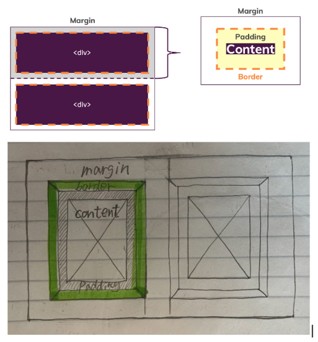

## CSS and Tailwind


### Common CSS Tags

  - [Mdn - CssReference](https://developer.mozilla.org/en-US/docs/Web/CSS/Reference)
  - [cssreference.io](https://cssreference.io/)

<details>
  <summary>"Element interaction with the user" or "visual feedback"</summary>

#### Cursor (Mouse pointer style)
| CSS Property           | Description                                | Tailwind Class          |
|------------------------|--------------------------------------------|--------------------------|
| `cursor: default;`     | Default arrow pointer.                     | `cursor-default`         |
| `cursor: pointer;`     | Hand icon, for clickable elements.         | `cursor-pointer`         |
| `cursor: text;`        | I-beam, for text selection.                | `cursor-text`            |
| `cursor: move;`        | Move icon (cross with arrows).             | `cursor-move`            |
| `cursor: wait;`        | Loading spinner or hourglass.              | `cursor-wait`            |
| `cursor: help;`        | Help icon (question mark).                 | `cursor-help`            |
| `cursor: not-allowed;` | Prohibited icon.                           | `cursor-not-allowed`     |
| `cursor: crosshair;`   | Precision cross icon.                      | `cursor-crosshair`       |
| `cursor: auto;`        | Browser default cursor.                    | `cursor-auto`            |
| `cursor: progress;`    | Background task in progress cursor.        | *(Not in Tailwind by default)* |

#### Content (`::before` and `::after`)
Used to insert content before or after an element.
```css
.element::before {
  content: "★";
}
```
> Tailwind does not support `content:` directly.

#### Opacity
| CSS          | Description         | Tailwind     |
|--------------|---------------------|--------------|
| `opacity: 0.5`| 50% transparency.  | `opacity-50` |

####  Mix Blend Mode
Defines how an element blends with the background.

| CSS Value    | Tailwind Class        |
|--------------|-----------------------|
| `multiply`   | `mix-blend-multiply`  |
| `screen`     | `mix-blend-screen`    |
| `overlay`    | `mix-blend-overlay`   |
| *(etc.)*     | *Supported in Tailwind* |

#### List Style
| CSS Property          | Description                               |
|-----------------------|-------------------------------------------|
| `list-style-image`    | Image as bullet point.                    |
| `list-style-position` | Bullet inside or outside.                 |
| `list-style-type`     | Bullet shape: disc, circle, square, etc.  |
| `list-style`          | Shorthand for all the above.              |

Tailwind:
```html
<ul class="list-disc list-inside">...</ul>
```

#### Outline
| CSS             | Description                                  |
|-----------------|----------------------------------------------|
| `outline-color` | Color of the outline                         |
| `outline-style` | Style: solid, dashed, etc.                   |
| `outline-width` | Width of the outline                         |
| `outline`       | Shorthand for color + style + width          |

> Outline does **not** take up space (unlike border).

Tailwind:
```html
<button class="outline outline-2 outline-red-500">Click</button>
```
#### Pointer Events
| CSS                | Description                  | Tailwind             |
|--------------------|------------------------------|----------------------|
| `pointer-events: none` | Disable mouse events.   | `pointer-events-none`|
| `pointer-events: auto` | Enable mouse events.    | `pointer-events-auto`|

#### Resize
Controls if an element (like `<textarea>`) is resizable.

| CSS Value     | Tailwind         |
|---------------|------------------|
| `none`        | `resize-none`    |
| `both`        | `resize`         |
| `vertical`    | `resize-y`       |
| `horizontal`  | `resize-x`       |

#### Vertical Align
Aligns inline or table-cell content vertically.

| CSS Value   | Tailwind         |
|-------------|------------------|
| `middle`    | `align-middle`   |
| `top`       | `align-top`      |
| `bottom`    | `align-bottom`   |

#### Will-Change
Hints the browser about expected changes.
```css
will-change: transform;
```

Tailwind: *(Use inline style)*
```html
<div style="will-change: transform;"></div>
```
</details>


<details>
  <summary>Background Images</summary>

The CSS properties that allow you to style the background of an element with colors and images
- [Background](https://cssreference.io/backgrounds/)

Shorthand Syntax Example
```css
background-image: url('image1.jpg');
background-repeat: no-repeat;
background-attachment: fixed;
background-position: center;
background-size: cover;
background-color: #ff0000;
```
```css
background: url('image1.jpg') no-repeat fixed center/cover #ff0000;
```
</details>


<details>
  <summary>SVG Basics</summary>

**SVG** (Scalable Vector Graphics) is used to define vector-based graphics directly within HTML. SVG images are scalable and do not lose quality, making them ideal for web design, logos, icons, and complex illustrations.

#### Basic SVG Structure
```html
<svg width="200" height="200" xmlns="http://www.w3.org/2000/svg">
  <!-- Your SVG content goes here -->
</svg>
```
- `width` and `height`: Set the size of the SVG container.
- `xmlns`: Declares the XML namespace for SVG.

#### Common SVG Elements

##### `<circle>` - Draws a circle
```html
<circle cx="100" cy="100" r="50" fill="blue" />
```
- `cx` and `cy`: X and Y coordinates of the circle's center.
- `r`: Radius of the circle.
- `fill`: Color of the circle.

##### `<rect>` - Draws a rectangle
```html
<rect x="50" y="50" width="100" height="50" fill="red" />
```
- `x` and `y`: Coordinates of the top-left corner.
- `width` and `height`: Dimensions of the rectangle.

##### `<line>` - Draws a straight line
```html
<line x1="0" y1="0" x2="200" y2="200" stroke="black" stroke-width="2" />
```
- `x1`, `y1`: Starting point of the line.
- `x2`, `y2`: Ending point of the line.
- `stroke`: Line color.
- `stroke-width`: Line thickness.

##### `<ellipse>` - Draws an ellipse
```html
<ellipse cx="100" cy="100" rx="80" ry="40" fill="green" />
```
- `rx` and `ry`: Horizontal and vertical radius.

##### `<polygon>` - Draws a shape with multiple sides
```html
<polygon points="50,150 100,50 150,150" fill="yellow" />
```
- `points`: A list of (x, y) coordinates for the polygon’s corners.

##### `<path>` - Draws complex shapes with commands
```html
<path d="M 10 80 C 40 10, 65 10, 95 80 S 150 150, 180 80" fill="none" stroke="purple" />
```
- The `d` attribute contains a series of commands to draw lines and curves.

SVG Drawing Example
```html
<!DOCTYPE html>
<html lang="en">
<head>
  <meta charset="UTF-8" />
  <meta name="viewport" content="width=device-width, initial-scale=1.0" />
  <title>SVG Example</title>
</head>
<body>
  <svg width="200" height="200" xmlns="http://www.w3.org/2000/svg">
    <!-- Circle -->
    <circle cx="100" cy="100" r="50" fill="blue" />

    <!-- Rectangle -->
    <rect x="25" y="25" width="50" height="50" fill="red" />

    <!-- Line -->
    <line x1="0" y1="0" x2="200" y2="200" stroke="black" stroke-width="2" />

    <!-- Ellipse -->
    <ellipse cx="100" cy="100" rx="80" ry="40" fill="green" />

    <!-- Polygon -->
    <polygon points="50,150 100,50 150,150" fill="yellow" />

    <!-- Path -->
    <path d="M 10 80 C 40 10, 65 10, 95 80 S 150 150, 180 80" fill="none" stroke="purple" stroke-width="2" />
  </svg>
</body>
</html>
```
Explanation
- **Circle**: A blue circle centered at (100, 100) with a radius of 50.
- **Rectangle**: A red square at position (25, 25) with dimensions 50x50.
- **Line**: A black diagonal line across the SVG canvas.
- **Ellipse**: A green ellipse centered at (100, 100) with horizontal and vertical radii 80 and 40.
- **Polygon**: A yellow triangle with specified points.
- **Path**: A purple curve created using Bézier curve commands.

> SVG elements can be styled with CSS, animated, and made interactive with JavaScript.
</details>


<details>
  <summary>Color</summary>

- [Color](https://cssreference.io/typography/)

#### Predefined Colors
  CSS comes with a set of named color values that can be used directly, such as:
  - `yellow`, `blue`, `pink`, `lavender`, `cyan`, `purple`, etc.

#### RGBA
RGBA stands for **Red, Green, Blue, Alpha**. It's formatted as:
```
rgba(red, green, blue, alpha)
```
- **Red**, **Green**, and **Blue** values range from 0 to 255.
- **Alpha** is the opacity level, where:
  - `1` is fully opaque
  - `0` is fully transparent
  - Values in between represent partial transparency
```css
rgba(100, 200, 40, 0.5)
```

#### RGB
RGB is similar to RGBA but **does not include opacity**. It's formatted as:
```
rgb(red, green, blue)
```
- All values range from 0 to 255
- Defaults to 100% opacity
```css
rgb(100, 200, 40)
```

####  HEX (Hexadecimal)
Hex is a way of representing colors using hexadecimal (base-16) notation.
- Begins with `#`
- Followed by **six digits** (0–9 and a–f)
- `#000000` is black
- `#ffffff` is white
```css
#ff5733
```

#### Named Color Example
You can use named colors in CSS like this:
```css
#container {
  background-color: darkslateblue;
}
```
</details>


<details>
  <summary>Typography</summary>

  Typography is the art of arranging letters and text to make the copy legible, clear, and visually appealing to the reader. It involves font style, appearance, and structure, which aims to elicit certain emotions and convey specific messages.

#### Choosing Type – Fonts Knowledge
- [Google Fonts](https://fonts.google.com/)
- [MyFonts](https://www.myfonts.com/)
- [Typography](https://cssreference.io/typography/)

#### Fonts
- `font-family`
- `font-size`
- `font-style`
- `font-variant`
- `font-weight`
- `font` (shorthand)

#### Spacing and Layout
- `letter-spacing`
- `line-height`
- `text-align`
- `text-decoration`
- `text-indent`
- `text-overflow`
- `text-shadow`
- `text-transform`
- `white-space`
- `word-break`
- `word-spacing`
</details>


<details>
  <summary>Sizing & Units</summary>

#### Key Properties
- `width`, `height`, `min-width`, `max-width`, `min-height`, `max-height`
- These properties set size constraints for elements

#### Why Use Them?
- **Responsive Design**: Keep elements looking good across screen sizes
- **Layout Consistency**: Prevent items from getting too small or large
- **Content Overflow Management**: Handle dynamic content gracefully

#### Units Overview
- ##### Pixels (`px`)
    - 100px ≈ 1 inch (depends on screen)
    - Use when fixed size is needed and doesn't need to scale
- #### Percentages (`%`)
    - Relative to the parent element's size
    - Useful for responsive scaling
- #### rem vs em
    - `1rem = 16px` (relative to `<html>` root font size)
    - `1em = 16px` by default (relative to **current** element's font size)

#### When to Use
- **rem**: Use rem: For global consistency and when you want elements to scale uniformly across your entire document. Ideal for setting typographic scales, margins, padding, etc.
- **em**: For component-level scaling where child elements should be sized relative to their parent. Useful for nested components and maintaining proportional scaling within a component.

#### Advantages
1. **Scalability & Accessibility**
   - **Responsive Design**: rem and em units allow for easier scaling of elements based on the font size, which is particularly useful for responsive design. When the root font size changes (e.g., based on a media query), all elements using rem units will scale accordingly.
   - **Accessibility**: Users can change their default browser font size for better readability. Using rem and em ensures that your design respects these user preferences.

2. **Consistency**
   - **Consistent Sizing**: rem units ensure consistent sizing across your entire document because they are relative to the root element (<html>). This makes it easier to maintain a harmonious visual hierarchy.
   - **Nested Elements**: em units can be useful for creating scalable components where child elements should size relative to their parent. This allows for consistent relative scaling within components.

3. **Maintainability**
   - **Easy Adjustments**: By changing the root font size, you can globally adjust the size of all elements using rem units. This is especially helpful for design tweaks or adjustments for different screen sizes.
   - **Reusable Components**: Using em units within components makes them more flexible and reusable in different contexts.

#### Viewport Units (`vh`, `vw`)
- `vh` = 1% of viewport height
- `vw` = 1% of viewport width
- ⚠️ Often buggy and not recommended unless used carefully

#### Which Units Should I Choose?
- Use `rem` for consistent, scalable layout design
- Use `em` for flexible, nested components
- Use `%` for responsive width/height
- Use `px` for precise control when necessary
- Avoid over-relying on `vh`/`vw` unless confident
</details>


<details>
  <summary>Centering</summary>

Centering elements in CSS can be done in a variety of ways depending on the type of layout (block, flex, grid, or inline elements) and whether you are centering horizontally, vertically, or both.

#### 1. Centering Block Elements Horizontally
For block-level elements like `div`, centering horizontally is often done using `margin: auto`.
```html
<div class="centered-box">I'm a centered box</div>
```
```css
.centered-box {
  width: 50%;
  margin: 0 auto;
  background-color: lightblue;
  text-align: center;
}
```

#### 2. Centering Inline Elements Horizontally
Use `text-align: center` on the parent.
```html
<div class="parent">
  <span class="centered-text">Centered Text</span>
</div>
```
```css
.parent {
  text-align: center;
}
```

#### 3. Centering with Flexbox
Flexbox is a modern, flexible way to center both horizontally and vertically with minimal code. You can use display: flex on a parent element to align items in both directions.
```html
<div class="flex-container">
  <div class="centered-item">I'm centered!</div>
</div>
```
```css
.flex-container {
  display: flex;
  justify-content: center;
  align-items: center;
  height: 100vh;
  background-color: lightgray;
}
.centered-item {
  background-color: lightblue;
  padding: 20px;
}
```
- justify-content: center; centers horizontally.
- align-items: center; centers vertically.

#### 4. Centering with CSS Grid
CSS Grid is another powerful layout tool that allows you to center items easily.

```html
<div class="grid-container">
  <div class="grid-item">I'm centered with Grid!</div>
</div>
```
```css
.grid-container {
  display: grid;
  place-items: center;
  height: 100vh;
  background-color: lightgray;
}
.grid-item {
  background-color: lightblue;
  padding: 20px;
}
```
- place-items: center; is shorthand for centering both horizontally and vertically in a grid.

#### 5. Absolute Centering with Transform
You can also center elements by using absolute positioning along with transform.

```html
<div class="absolute-container">
  <div class="absolute-centered">I'm absolutely centered!</div>
</div>
```
```css
.absolute-container {
  position: relative;
  height: 100vh;
  background-color: lightgray;
}
.absolute-centered {
  position: absolute;
  top: 50%;
  left: 50%;
  transform: translate(-50%, -50%);
  background-color: lightblue;
  padding: 20px;
}
```
- **top: 50%; left: 50%;** moves the element to the center of the parent.
- **transform: translate(-50%, -50%);** adjusts the element to center relative to its own dimensions.


#### 6. Vertically Center Single-Line Text with Line-Height
If you need to vertically center text inside a block element, you can use line-height for simple single-line text.
```html
<div class="centered-text-box">Centered Text</div>
```
```css
.centered-text-box {
  height: 200px;
  line-height: 200px;
  text-align: center;
  background-color: lightblue;
}
```
- This method works for single-line text but not for multiline content.

#### Summary
- **Block elements**: Use **margin: auto** for horizontal centering.
- **Flexbox**: The most flexible and modern method for centering both horizontally and vertically with **justify-content** and **align-items**.
- **Grid**: Use **place-items: center** for easy centering in both directions.
- **Absolute Positioning**: Combine with `transform`for precise control.
- **Text**: Use `text-align`for horizontal centering and `line-height`for vertical centering in simple cases.

#### Horizontally Center Block Elements

```css
.potato {
   margin-right: auto;
   margin-left: auto;
}
```
Or simply:
```css
.potato {
   margin: 0 auto;
}
```

#### Vertically Center Block Elements Using Absolute Position

```css
#big-potato {
   width: 100px;
   height: 50px;
   position: absolute;
   top: 50%;
}
```

#### Using `transform` to Vertically Center the Block Element

The `transform` property allows you to apply various transformations to elements, such as rotation, scaling, skewing, or translation (moving).

```css
#big-potato {
   position: absolute;
   top: 50%;
   transform: translateY(-50%);
}
```

#### Examples of Transform Functions
- Translate: Moves an element along the x and y axes
```css
transform: translate(50px, 100px);
```
- Rotate: Rotates the element by a specified angle
```css
transform: rotate(45deg);
```
- Scale: Scales the element along the x and y axes by the specified factor
```css
transform: scale(1.5, 1.5);
```
- Skew: Skews the element along the x and y axes
```css
transform: skew(30deg, 20deg);
```
- Multiple transforms: Combine multiple transforms with a space
```css
transform: translate(50px, 50px) rotate(45deg) scale(1.2);
```
- Transform Origin: Specifies the origin point of the transform
```css
transform-origin: top left;
```

#### Center Block Elements Both Horizontally and Vertically
```css
#big-potato {
   position: absolute;
   top: 50%;
   left: 50%;
   transform: translate(-50%, -50%);
}
```
</details>


<details>
  <summary>CSS Selectors</summary>

<details>
  <summary>CSS Selectors Summary</summary>
This is a comprehensive list of CSS selectors with examples and descriptions.

| **Selector** | **Example** | **Description** |
|--------------|-------------|-----------------|
| `.class` | `.intro` | Selects all elements with class="intro" |
| `.class1.class2` | `.name1.name2` | Selects all elements with both name1 and name2 set within its class attribute |
| `.class1 .class2` | `.name1 .name2` | Selects all elements with name2 that is a descendant of an element with name1 |
| `#id` | `#firstname` | Selects the element with id="firstname" |
| `*` | `*` | Selects all elements |
| `element` | `p` | Selects all `<p>` elements |
| `element.class` | `p.intro` | Selects all `<p>` elements with class="intro" |
| `element,element` | `div, p` | Selects all `<div>` elements and all `<p>` elements |
| `element element` | `div p` | Selects all `<p>` elements inside `<div>` elements |
| `element>element` | `div > p` | Selects all `<p>` elements where the parent is a `<div>` element |
| `element+element` | `div + p` | Selects the first `<p>` element that is placed immediately after `<div>` elements |
| `element1~element2` | `p ~ ul` | Selects every `<ul>` element that is preceded by a `<p>` element |
| `[attribute]` | `[target]` | Selects all elements with a `target` attribute |
| `[attribute=value]` | `[target="_blank"]` | Selects all elements with `target="_blank"` |
| `[attribute~=value]` | `[title~="flower"]` | Selects all elements with a `title` attribute containing the word "flower" |
| `[attribute|=value]` | `[lang|="en"]` | Selects all elements with a `lang` attribute equal to "en" or starting with "en-" |
| `[attribute^=value]` | `a[href^="https"]` | Selects every `<a>` element whose href attribute value begins with "https" |
| `[attribute$=value]` | `a[href$=".pdf"]` | Selects every `<a>` element whose href attribute value ends with ".pdf" |
| `[attribute*=value]` | `a[href*="w3schools"]` | Selects every `<a>` element whose href attribute contains "w3schools" |
| `:active` | `a:active` | Selects the active link |
| `::after` | `p::after` | Inserts content after each `<p>` element |
| `::before` | `p::before` | Inserts content before each `<p>` element |
| `:checked` | `input:checked` | Selects every checked `<input>` element |
| `:default` | `input:default` | Selects the default `<input>` element |
| `:disabled` | `input:disabled` | Selects every disabled `<input>` element |
| `:empty` | `p:empty` | Selects every `<p>` element that has no children |
| `:enabled` | `input:enabled` | Selects every enabled `<input>` element |
| `:first-child` | `p:first-child` | Selects every `<p>` element that is the first child of its parent |
| `::first-letter` | `p::first-letter` | Selects the first letter of every `<p>` element |
| `::first-line` | `p::first-line` | Selects the first line of every `<p>` element |
| `:first-of-type` | `p:first-of-type` | Selects every `<p>` that is the first of its type among siblings |
| `:focus` | `input:focus` | Selects the input element with focus |
| `:fullscreen` | `:fullscreen` | Selects the element in full-screen mode |
| `:has()` | `h2:has(+p)` | Selects `<h2>` elements immediately followed by a `<p>` element |
| `:hover` | `a:hover` | Selects links when hovered |
| `:in-range` | `input:in-range` | Selects inputs with a value within a range |
| `:indeterminate` | `input:indeterminate` | Selects inputs in an indeterminate state |
| `:invalid` | `input:invalid` | Selects inputs with invalid values |
| `:lang()` | `p:lang(it)` | Selects `<p>` elements with `lang="it"` |
| `:last-child` | `p:last-child` | Selects every `<p>` that is the last child of its parent |
| `:last-of-type` | `p:last-of-type` | Selects every `<p>` that is the last of its type among siblings |
| `:link` | `a:link` | Selects all unvisited links |
| `::marker` | `::marker` | Selects list item markers |
| `:not()` | `:not(p)` | Selects everything except `<p>` elements |
| `:nth-child(n)` | `p:nth-child(2)` | Selects the second child `<p>` element |
| `:nth-last-child(n)` | `p:nth-last-child(2)` | Selects the second-to-last `<p>` child |
| `:nth-last-of-type(n)` | `p:nth-last-of-type(2)` | Selects the second-to-last `<p>` of its type |
| `:nth-of-type(n)` | `p:nth-of-type(2)` | Selects the second `<p>` of its type |
| `:only-of-type` | `p:only-of-type` | Selects `<p>` if it's the only `<p>` among siblings |
| `:only-child` | `p:only-child` | Selects `<p>` if it's the only child of its parent |
| `:optional` | `input:optional` | Selects inputs without the "required" attribute |
| `:out-of-range` | `input:out-of-range` | Selects inputs with out-of-range values |
| `::placeholder` | `input::placeholder` | Selects the placeholder text of inputs |
| `:read-only` | `input:read-only` | Selects inputs marked as read-only |
| `:read-write` | `input:read-write` | Selects inputs that are editable |
| `:required` | `input:required` | Selects inputs marked as required |
| `:root` | `:root` | Selects the document's root element |
| `::selection` | `::selection` | Selects the part of an element that is selected |
| `:target` | `#news:target` | Selects the element targeted by a URL anchor |
| `:valid` | `input:valid` | Selects inputs with valid values |
| `:visited` | `a:visited` | Selects visited links |
</details>


<details>
  <summary>Cascade, Specificity, Inheritance</summary>

Child elements inherit properties from parent elements. If a child does not define its own value for a property, it inherits from the parent.

#### Tag Selectors
```css
h2 {
  color: red;
  width: 20px;
  height: 40px;
} /*All elements of type `h2` in your HTML will be affected.*/
```

#### Class Selectors
**Class** — Apply a set of rules to multiple elements on the page.
- **HTML**: Add the `class` attribute to the opening tag.
- **CSS**: Use a period `.` in front of the class name as a selector.
```html
<p class="green">Green text</p>
<p class="green">Green text 2</p>
<div class="green">Also green</div>
```
```css
.green {
  color: green;
}
```

#### ID Selectors
**ID** — Apply a set of rules to only one distinct element on the page.
- **HTML**: Add the `id` attribute to the opening tag.
- **CSS**: Use a hashtag `#` in front of the ID name as a selector.

```html
<p id="blue">Blue text</p>
```
```css
#blue {
  color: blue;
}
```
</details>

<details>
  <summary>Advanced CSS Selectors</summary>

#### 1.Universal Selector (*)
The universal selector `*` affects all elements on the page.

```css
* {
  margin: 0;
  padding: 0;
}
```
> ⚠️ Use it with caution; it's very powerful and not recommended for frequent use.
##### 2.Alternative: Use inheritance
For example, apply font-family on `html` so it cascades to children:

```css
html {
  font-family: "Comic Sans";
}
```


#### 3.Grouping Selectors with Commas (,)
Use commas to apply styles to multiple, unrelated elements.

```css
h1, h2, h3 {
  /* Applies to all h1, h2, and h3 elements */
}
```
```css
h1, h2, #special-heading {
  color: blue;
  background: gray;
}
```
```css
.one, .two, #three {
  font-size: 32px;
}
```

#### 4.Combining Selectors (No comma = AND)
To apply styles to elements matching multiple conditions, write selectors together without commas.

```css
h1.my-title.red-text {
  color: red;
  font-size: 50px;
}
/* Only h1s with both class "my-title" and "red-text" will be affected */
```

##### Selecting Element with Multiple Class Names
```css
.green.big {
  color: green;
  font-size: 64px;
}
```

#### 5.Descendant Selectors (Hierarchy - space)
To apply styles to child elements at any depth within a parent, use a space between selectors.

```css
.text h1 {
  color: blue;
}
```
```css
.text .pretty {
  color: green;
}

.text .ugly {
  width: 4rem;
}
```

#### 6.Nested Selectors (e.g. within a div)

Example:
```html
<div id="jay">
  <p class="park">Jay Park <3</p>
</div>
```
```css
#jay .park {
  font-size: 32px;
}
```
This selects all `.park` elements inside the element with ID `jay`.
</details>

<details>
  <summary>CSS Combinators & Combined Selectors</summary>

This example demonstrates how to use **multiple CSS classes** and **combined selectors** to style a webpage layout.

```html
<body>
   <nav>
       <a href="#intro" class="active">Intro</a>
       <a href="#outro">Outro</a>
   </nav>

   <section id="intro" class="main-section highlighted">
       <p>This is the intro section.</p>
   </section>

   <section id="outro" class="main-section">
       <p>This is the outro section.</p>
   </section>
</body>
```
```css
body {
   font-family: sans-serif;
}
```
- Applies a sans-serif font to the entire document.

```css
nav {
   margin-bottom: 16px;
   background: #fa923f;
   padding: 8px 0;
}
```
- Adds spacing below the navigation, a background color, and vertical padding.

```css
a {
   text-decoration: none;
   color: white;
   margin: 10px;
}
```
- Removes underline from links, colors them white, and adds margin around them.

```css
a.active {
   color: #521751;
}
```
- Targets links with the class `active` and overrides their color.

```css
a {
   color: blue;
}
```
- A later rule that overrides all `<a>` tag color to blue. This makes `.active` less effective unless specificity is increased.

```css
.main-section {
   height: 800px;
   border: 1px solid #ccc !important;
   padding: 16px;
}
```
- Creates tall section boxes with borders and padding. `!important` enforces the border style.

```css
.highlighted {
   border: 2px solid #ea5c24;
   height: 200px;
}
```
- For highlighted sections, applies a thicker orange border and sets a smaller height.

#### !important 
keyword in CSS is used to give a CSS rule higher priority over other conflicting rules. When !important is added to a CSS property, that property will always be applied, regardless of the specificity of other rules. However, it should be used sparingly as it can make the CSS code harder to maintain and override.

Used to force rule priority:
```css
p {
  color: red !important;
}
```
</details>


<details>
  <summary>CSS Pseudo-Selectors, `calc()`, and Geometric Shapes with CSS</summary>

#### Pseudo-Selectors

Common Link States
```css
/* Unvisited link */
a {
    color: darkblue;
    text-decoration: none;
}

/* Explicit unvisited link */
a:link {
    color: #FF0000;
}

/* Visited link */
a:visited {
    color: #00FF00;
}

/* Hover (mouse over) */
a:hover {
    color: #FF00FF;
}

/* Active (mouse is currently clicking the link) */
a:active {
    color: #0000FF;
}
```

Action Button with Pseudo-Selectors

```html
<div>
  <button class="button">CHOOSE PLAN</button>
</div>
```

```css
.button {
  background: #0e4f1f;
  color: white;
  font: inherit;
  border: 1.5px solid #0e4f1f;
  padding: 8px;
  border-radius: 8px;
  font-weight: bold;
  cursor: pointer;
}

.button:hover, .button:active {
  background: white;
  color: #0e4f1f;
}

.button:focus {
  outline: none;
}
```

#### `calc(50% - 240px)`

This is a CSS expression used to calculate layout values, especially for positioning and sizing elements.

- `50%` represents half of the available width or height of the containing element.
- `- 240px` subtracts 240 pixels from that value.

This is typically used to **center an element horizontally** within its container. By subtracting **half of the element’s fixed width**, you effectively shift it left so that it's centered.

**Example:**  
If a container is `1000px` wide and the element is `480px` wide,  
`calc(50% - 240px)` will position the element so its left edge is 240px left of the center—perfectly centered.

#### Creating Geometric Shapes with HTML and CSS

You can use CSS properties like:

- `width`, `height`
- `background-color`
- `border`
- `border-radius`
- `position`

For example: `border-radius: 50%`

This creates **curved corners** or even perfect **circles**.

- `border-radius` accepts one to four values to define the roundness of each corner.
- Units can be pixels, percentages, or other length units.
- If fewer than four values are provided, the browser assumes symmetry starting from the top-left corner and rotating clockwise.

```css
/* Circle */
.circle {
  width: 100px;
  height: 100px;
  background-color: red;
  border-radius: 50%;
}
```
</details>
</details>


<details>
  <summary>Box Model</summary>
  
- [Box model](https://cssreference.io/box-model/)
### 📦 Box Model Components

The **Box Model** includes the following layers (from innermost to outermost):

1. **Content** – The actual content of the box (e.g., text, images).
2. **Padding** – Space between content and the border.
3. **Border** – Surrounds the padding (if any) and content.
4. **Margin** – Space outside the border.




### Dimensions & Spacing

#### Width & Height
```css
width: 300px;
height: auto;
```

#### Padding
```css
padding: 15px;
/* or specify each side individually */
padding-top: 15px;
padding-right: 15px;
padding-bottom: 15px;
padding-left: 15px;
```

#### Border
```css
border: 10px solid skyblue;
/* or specify each side */
border-top-width: 10px;
border-right-style: solid;
border-left-color: skyblue;
...
```

#### Margin
```css
margin: 30px;
/* or specify each side */
margin-top: 30px;
margin-right: 30px;
margin-bottom: 30px;
margin-left: 30px;
```

#### Additional Properties
- `box-shadow`: Adds shadow around the box.
- `box-sizing`: Defines whether `width/height` include padding and border.
- `max-width`, `max-height`, `min-width`, `min-height`: Set size constraints.
- `mix-blend-mode`: Defines how the box blends with background.

Example

```html
<div class="box">
  Welcome to WDD!
</div>
<div class="box">
  Homework 3 will be released tonight.
</div>
```
```css
.box {
   background-color: white;
   width: 300px;
   padding: 15px;
   border: 10px solid skyblue;
   margin: 30px;
}
```
> We can have different amounts of spacing on different sides of the box. The four sides are: **top, right, bottom, and left**.

Clockwise Shorthand Example
```css
/* top right bottom left */
padding: 16px 16px 16px 16px;
margin: 16px 16px 16px 16px;
```

## Height & Width Values
```css
width: 100%;
height: 100%;
width: 300px;
height: 128px;
```
</details>


<details>
  <summary>Layout</summary>
  
**display** - The `display` property in CSS is used to set the display behavior of an element. It determines how an element is rendered in the flow of the document and how it interacts with other elements.
- **block**: The element is displayed as a block (starts on a new line and takes full width).
- **inline**: The element is displayed inline (on the same line as other elements, width depends on content).
- **inline-block**: Like inline, but allows setting width and height.
- **flex**: Enables Flexbox layout, allowing alignment and distribution of space among items.
- **grid**: Enables Grid layout, defining rows and columns.
- **none**: The element is not displayed (hidden from layout).
- **contents**: Makes the element disappear, but its children remain.
- **table**: Behaves like a `<table>`.
- **table-row**, **table-cell**, etc.: Mimic table structure elements.

```css
display: inline-flex;
display: inline-grid;
```
```html
<div class="container">
  <div class="item">Centered Item</div>
</div>
```
```css
.container {
  display: flex;
  justify-content: center;
  align-items: center;
}
```
Notes
- The `display` property is fundamental for controlling layout.
- Flex and Grid are powerful modern layouts for responsive design.
- Always choose the `display` type based on the structure and layout needs of your content.

**Float** - The `float` property in CSS is used to position an element to the left or right of its container, allowing text and inline elements to wrap around it.
This property was commonly used for layouts before CSS Flexbox and Grid. Use it carefully to avoid complex layout problems.

**Clear** - The `clear` property is used to move an element below any preceding floated elements.

**Columns**
- `column-count`: Defines the number of columns in the element.
- `column-gap`: Defines the space between columns.
- `column-width`: Defines the width of the columns.

**Overflow**
- `overflow`: Controls content spilling over its container. Options: `visible`, `hidden`, `scroll`, `auto`.
- `overflow-x`: Controls horizontal overflow.
- `overflow-y`: Controls vertical overflow.
- `overflow-wrap`: Controls if long words are broken and wrap to the next line.

**Display Types**
- Inline
Displays the element inline, like a `<span>`. Height and width properties do not apply.
Inline elements sit next to each other on the same line. Common use case: horizontally aligned buttons.
- Block
A block element starts on a new line and takes up the full width available by default.

Display Property Examples
- `display: block;`: Converts inline elements to block and allows setting width and height.
- `display: inline;`: Converts block elements to inline.
- `display: inline-block;`: Keeps block layout but allows elements to sit side-by-side.
- `display: none;`: Removes the element completely from layout.
- `visibility: hidden;`: Makes the element invisible but it still occupies space.

**Block-Level Elements** - These elements start on a new line and take up full width:
```html
<div>...</div>
<p>...</p>
<h1>...</h1>
<blockquote>...</blockquote>
<article>...</article>
<section>...</section>
<nav>...</nav>
```
**Inline Elements** - These elements do not start on a new line and take only as much width as needed:
```html
<span>...</span>
<a href="#">...</a>

<strong>...</strong>
<em>...</em>
<code>...</code>
```

**Vertical Align** - Applying the Display Property & Styling Our Navigation Bar

`text-decoration`
This CSS property specifies the decoration added to text, such as underlines, overlines, or line-throughs.  
```css
a {
  text-decoration: none; /* removes the underline from links */
}
```
 `vertical-align`
This property sets the vertical alignment of an inline or table-cell element. It aligns the element relative to its surrounding content or its parent element.
```css
img {
  vertical-align: middle;
}
```
Used commonly to align text and images within the same line.


**CSS Box Example**

Use display and float
The float property in CSS is used to position an element to the left or right of its container, allowing text and inline elements to wrap around it. This property can be useful for creating layouts, especially before the advent of CSS Flexbox and Grid. However, it should be used judiciously to avoid complex layout issues.
```css
.box {
   display: inline-block;
   float: left;
   background-color: white;
   width: 300px;
   padding: 15px;
   border: 10px solid skyblue;
   padding: 30px;	
}
```
</details>


<details>
  <summary>Positioning</summary>

- [Positioning](https://cssreference.io/positioning/)

**Positioning**
- position - Defines the position behavior of the element
- top - Defines the position of the element according to its top edge
- bottom - Defines the position of the element according to its bottom edge
- left - Defines the position of the element according to its left edge
- right - Defines the position of the element according to its left edge
- z-index - Defines the order of the elements on the z-axis. It only works on positioned elements (anything apart from static)

### Static
**`position: static;`**  
The element is positioned according to the normal document flow.  
This is the default positioning. Block boxes flow vertically from the top of their containing block and typically take up the full width of their parent unless specified otherwise.  
A block element (like `<div>` or `<p>`) is stacked below the previous one.  
Inline elements reside inside block-level containers and are arranged side by side. If they reach the right edge of the container, they wrap to the next line.  
Static elements are not affected by `top`, `bottom`, `left`, or `right`.
```html
<div class="container">
  <div class="a"></div>
  <div class="b"></div>
  <div class="c"></div>
</div>
```

### Relative
**`position: relative;`**  
Positions the element relative to its default static location.  
The element retains its original space in the flow but can be offset.  
Surrounding elements are not affected by this offset.

```css
.a {
  /* default styling */
}
.b {
  position: relative;
  top: 20px;
  left: 30px;
}
.c {
  /* default styling */
}
```

### Fixed
**`position: fixed;`**  
Removes the element from normal document flow and positions it relative to the viewport (browser window).  
The position remains unchanged even when the user scrolls.  
No space is left where the element would have been.  
Typically used for navigation bars or floating buttons.  
Use `top`, `bottom`, `left`, and `right` to place the element.  
You must define a width and height for inline elements.

### Absolute
**`position: absolute;`**  
Removes the element from normal document flow and positions it relative to the **closest positioned ancestor** (i.e., the nearest ancestor with a `position` other than `static`).  
If no positioned ancestor exists, it uses the `body` element as the reference.  
The space the element originally occupied is removed.  
Useful for layering on top of or underneath other elements using `z-index`.

```css
.container {
  position: relative;
}
.b {
  position: absolute;
  right: 0px;
  top: 0px;
}
```

### Sticky
**`position: sticky;`**  
A hybrid between `relative` and `fixed`.  
Acts like `relative` until a defined scroll threshold is passed, then it behaves like `fixed`.  
It "sticks" to the specified position when the user scrolls past it.  
Use `top`, `bottom`, `left`, and `right` to define thresholds.

### Z-Index
**`z-index`** defines the stacking order of positioned elements and their descendants.  
Higher `z-index` values stack above lower ones.

```css
.a {
  z-index: 1;
}
.b {
  position: relative;
  left: 50px;
  bottom: 20px;
  z-index: 0; /* default */
}
```
</details>


<details>
  <summary>Flexbox</summary>

- [Flexbox](https://cssreference.io/flexbox/)

Flexbox is a powerful CSS layout module that allows responsive alignment and distribution of space among items in a container—even when their size is unknown or dynamic.
Flexbox makes it easier to design flexible, responsive layout structures without the need for positioning.  
The main purpose of Flexbox is to adapt the size of flex items to fit within a container.  
A flex container can shrink or stretch as needed, which makes it very useful for responsive websites where element sizes may change.  

- #### Content Awareness
One huge benefit of Flexbox is its content awareness.  
Different rows respond uniquely to the available space and adjust the elements inside accordingly.  
Since it works in one dimension (row), it can change item widths without needing to worry about columns.  

To take full advantage of Flexbox, avoid specifying fixed widths when writing CSS for flex containers.  
Setting fixed widths removes the main flexibility advantage of using flexbox, as items will no longer behave dynamically.

- #### `flex-grow`
The `flex-grow` property defines how items inside a Flexbox container should take up available space.  
The default value is `0`, and it must be specified in the CSS class specific to that element.

- #### `flex-wrap`
This is similar to the `flex-wrap` property, which allows items to wrap onto the next line if there are too many elements in the container.

-  #### `justify-content`
The `justify-content` property helps align elements inside the container.  
It becomes helpful when the items are inflexible and you want to use the available space in the container to align them.  
By default, Flexbox attempts to place all elements on the same row.  
However, by specifying `flex-wrap`, you can spread the elements across multiple rows.

-  #### Alignment Strategy
Flexbox alignment can get tricky. It's important to track your items carefully since they can stretch and shrink in different ways depending on the properties you've defined.  
You can specify direction, spacing, alignment, and more...

---

### Properties for the Parent (Flex Container)

 **`display`**
Defines a flex container. Use `flex` or `inline-flex`. It enables a flex context for all direct children.
```css
display: flex;        /* block-level flex container */
display: inline-flex; /* inline-level flex container */
```

**`flex-direction`**
Defines the **main axis** of the flex container. Determines how flex items are placed.
```css
flex-direction: row;           /* horizontal (left to right) */
flex-direction: row-reverse;   /* horizontal (right to left) */
flex-direction: column;        /* vertical (top to bottom) */
flex-direction: column-reverse;/* vertical (bottom to top) */
```

**`flex-wrap`**
By default, flex items try to fit on one line. Use this property to allow wrapping.
```css
flex-wrap: nowrap;       /* all items on one line (default) */
flex-wrap: wrap;         /* wrap items to next line */
flex-wrap: wrap-reverse; /* wrap in reverse direction */
```

**`flex-flow`**
Shorthand for `flex-direction` and `flex-wrap`.
```css
flex-flow: column wrap; /* same as flex-direction: column; flex-wrap: wrap; */
```

**Fleshing out by flexing**
```html
<div id="best-box"> 
  <div class="child">child</div>
  <div class="child">child</div>
</div>
```
```css
#best-box {
  display: flex;
  flex-direction: row;
}
```

**Flex direction: row**
```css
#best-box {
  display: flex;
  flex-direction: row;
}
```

**Flex direction: row-reverse**
```css
#best-box {
  display: flex;
  flex-direction: row-reverse;
}
```

**Flex direction: column**
```css
#best-box {
  display: flex;
  flex-direction: column;
}
```

**Flex direction: column-reverse**
```css
#best-box {
  display: flex;
  flex-direction: column-reverse;
}
```

**Nested Flexboxes Example**

```html
<div id="best-box">
  <div class="child">
    <p>1</p>
    <p>2</p>
  </div>
  <div class="child">
    <p>3</p>
    <p>4</p>
  </div>
</div>
```
```css
#best-box {
  display: flex;
  flex-direction: row;
}

.child {
  display: flex;
  flex-direction: row;
}
```
**Flexbox Axes with `flex-direction: row`**
- **Main axis**: Left to right
- **Cross axis**: Top to bottom

---

### Flexbox Properties for Children (Flex Items)
This document summarizes key CSS flexbox properties, especially for flex items (children elements), translated into English.

**`justify-content`**
Defines the alignment along the **main axis** (horizontal by default). It helps distribute leftover space when:
- Items are inflexible, or
- Flexible but have reached their maximum size.

It also influences item alignment when they **overflow the container**.

**Common and safe values**:
- `flex-start`
- `flex-end`
- `center`

**Syntax**:
```css
.container {
  justify-content: flex-start | flex-end | center | space-between | space-around | space-evenly | start | end | left | right [safe | unsafe];
}
```
Examples
**Centering items:**
```css
#best-box {
  display: flex;
  flex-direction: row;
}
.child {
  display: flex;
  flex-direction: row;
  justify-content: center;
}
```
**Distributing space between items:**
```css
.child {
  display: flex;
  flex-direction: row;
  justify-content: space-around;
}
```
**Summary**
Distributes **extra space** along the main flex-direction axis.

🔗 [CSS-Tricks Guide to Flexbox](https://css-tricks.com/snippets/css/a-guide-to-flexbox/)

**`align-items`**
Defines how flex items are aligned along the **cross axis** (vertical by default).

**Syntax**:
```css
.container {
  align-items: stretch | flex-start | flex-end | center | baseline | first baseline | last baseline | start | end | self-start | self-end [safe | unsafe];
}
```

Examples

**Centering items:**
```css
.child {
  display: flex;
  flex-direction: row;
  align-items: center;
}
```
**Aligning to flex-start:**
```css
.child {
  display: flex;
  flex-direction: row;
  align-items: flex-start;
}
```
**Aligning to flex-end:**
```css
.child {
  display: flex;
  flex-direction: row;
  align-items: flex-end;
}
```
**Summary**
Aligns **children** along the **cross axis**.


**justify-content` + `align-items` Combined**

```css
.child {
  display: flex;
  flex-direction: row;
  justify-content: flex-end;
  align-items: flex-end;
}
```
Another example:
```css
.child {
  display: flex;
  flex-direction: row;
  justify-content: space-between;
  align-items: center;
}
```

**`align-content`**

Aligns flex **lines** along the cross axis when there’s extra space, similar to how `justify-content` aligns items in the main axis.

**Syntax**:
```css
.container {
  align-content: flex-start | flex-end | center | space-between | space-around | space-evenly | stretch | start | end | baseline | first baseline | last baseline [safe | unsafe];
}
```

**`gap`, `row-gap`, `column-gap`**

Defines **space between flex items**, not including the outer edges.

**Syntax**:
```css
.container {
  display: flex;
  gap: 10px;
  gap: 10px 20px; /* row-gap column-gap */
  row-gap: 10px;
  column-gap: 20px;
}
```

Example 1: Basic Flex Container

```html
<ul class="flex-container">
  <li class="flex-item">1</li>
  <li class="flex-item">2</li>
  <li class="flex-item">3</li>
  <li class="flex-item">4</li>
  <li class="flex-item">5</li>
  <li class="flex-item">6</li>
</ul>
```

```css
.flex-container {
  /* Create a flex layout context */
  display: flex;
  /* Set direction and allow wrapping */
  flex-flow: row wrap;
  /* Distribute space around items */
  justify-content: space-around;
  padding: 0;
  margin: 0;
  list-style: none;
}

.flex-item {
  background: tomato;
  padding: 5px;
  width: 200px;
  height: 150px;
  margin-top: 10px;
  line-height: 150px;
  color: white;
  font-weight: bold;
  font-size: 3em;
  text-align: center;
}
```

Example 2: Responsive Navigation Menu

```html
<ul class="navigation">
  <li><a href="#">Home</a></li>
  <li><a href="#">About</a></li>
  <li><a href="#">Products</a></li>
  <li><a href="#">Contact</a></li>
</ul>
```

```css
.navigation {
  display: flex;
  flex-flow: row wrap;
  justify-content: flex-end;
  list-style: none;
  margin: 0;
  background: deepskyblue;
}

.navigation a {
  text-decoration: none;
  display: block;
  padding: 1em;
  color: white;
}

.navigation a:hover {
  background: #1565C0;
}

@media all and (max-width: 800px) {
  .navigation {
    justify-content: space-around;
  }
}

@media all and (max-width: 600px) {
  .navigation {
    flex-flow: column wrap;
    padding: 0;
  }

  .navigation a {
    text-align: center;
    padding: 10px;
    border-top: 1px solid rgba(255, 255, 255, 0.3);
    border-bottom: 1px solid rgba(0, 0, 0, 0.1);
  }

  .navigation li:last-of-type a {
    border-bottom: none;
  }
}
```

Example 3: Responsive Layout with Header, Footer, Main, and Asides

```html
<div class="wrapper">
  <header class="header">Header</header>
  <article class="main">...</article>
  <aside class="aside aside-1">Aside 1</aside>
  <aside class="aside aside-2">Aside 2</aside>
  <footer class="footer">Footer</footer>
</div>
```

```css
.wrapper {
  display: flex;
  flex-flow: row wrap;
  font-weight: bold;
  text-align: center;
}

.wrapper > * {
  padding: 10px;
  flex: 1 100%;
}

.header {
  background: tomato;
}

.footer {
  background: lightgreen;
}

.main {
  text-align: left;
  background: deepskyblue;
}

.aside-1 {
  background: gold;
}

.aside-2 {
  background: hotpink;
}

@media all and (min-width: 600px) {
  .aside {
    flex: 1 0 0;
  }
}

@media all and (min-width: 800px) {
  .main {
    flex: 3 0px;
    order: 2;
  }

  .aside-1 {
    order: 1;
  }

  .aside-2 {
    order: 3;
  }

  .footer {
    order: 4;
  }
}

body {
  padding: 2em;
}
```
</details>


<details>
  <summary>	Grid</summary>
  
- [Grid](https://cssreference.io/css-grid/)
- [Cssgrid-generator](https://cssgrid-generator.netlify.app/)

- grid-area
- grid-auto-columns
- grid-auto-flow
- grid-auto-rows
- grid-column-end
- grid-column-gap
- grid-column-start
- grid-column
- grid-gap
- grid-row-end
- grid-row-gap
- grid-row-start
- grid-row
- grid-template-areas
- grid-template-columns
- grid-template-rows
- grid-template
- Grid


This is a simple way to lay out elements in a grid.  
The grid places elements in a two-dimensional matrix. Vertical lines are columns, and horizontal lines are rows.  
Using a grid allows you to change the size of columns and rows, making it a powerful option for placing elements.  
However, note that a grid isn't necessarily a perfect matrix.  
You can merge columns for specific rows, wrap content, and give individual items different widths to customize the layout.

`display: grid` is one of the newer layout methods in CSS and is very powerful, but it can also be complex.  
Therefore, it is recommended to use it only when you truly have a grid of items and `display: flex` isn't good enough.

#### Grid Container
The grid container is the element that contains grid items.  
We can create a grid container by specifying the `display` property (see the example at the bottom of this section).

#### Grid Lines
Grid lines divide the container into rows and columns.  
They can be referenced using indices starting from the top-left corner.  
This means the index for the first row or column line is 1 (unlike arrays/matrices in Python or Java which start at 0).

#### Grid Cell
Grid cells are formed at the intersection of row and column lines.  
They are defined by 2 row lines and 2 column lines to form a box.  
This is where you can place elements inside the grid.  
A grid cell is the smallest possible space unit in the grid.

#### Grid Area
A grid area is created by combining one or more adjacent grid cells into a larger space.  
Therefore, a grid cell is also a grid area.

```css
.grid-container {
  display: grid;
  grid-template-columns: auto auto auto;
  background-color: #2196f3;
  padding: 10px;
}
.grid-item {
  background-color: rgba(255, 255, 255, 0.8);
  border: 1px solid rgba(0, 0, 0, 0.8);
  padding: 20px;
  font-size: 30px;
  text-align: center;
}
```
```html
<div class="grid-container">
  <div class="grid-item">1</div>
  <div class="grid-item">2</div>
  <div class="grid-item">3</div>
  <div class="grid-item">4</div>
  <div class="grid-item">5</div>
  <div class="grid-item">6</div>
</div>
```
### When to Use Grid vs Flexbox

When your items are aligned in a single dimension (i.e., all in a horizontal or vertical line), they often behave similarly. In these cases, we recommend using **Grid**.

The key difference arises in **two-dimensional layouts**. If you want items to **wrap fluidly**, use **Flexbox** with `flex-wrap: wrap`; otherwise, use **Grid**.
- **Flexbox** layout is best suited for **components and small-scale layouts** in applications.
- **Grid** layout is more appropriate for **larger-scale layouts**.


### `Float`
The `float` property was very popular before modern layout methods like Flexbox and Grid existed. Although those are more commonly used now, `float` still exists but is not widely used due to its often confusing behavior.
Float can be "left" or "right", which moves the element to the left or right edge of its containing element. Other content wraps around the floated element.
For example, if we have an `` inside a `<p>` and we set the image's `float` to "right", the image will appear on the right side of its container, with text wrapping around the top, left, and bottom of the image.

**Cascading and Specificity**

CSS stands for “Cascading Style Sheets.” So what does "cascading" mean?
The idea is that styles on elements "cascade" from various sources (like their parent elements, classes, the browser’s default styles, etc.).
CSS needs rules to decide which style source takes priority. In the example below, the color of the `span` text has two potential sources: it could inherit the color from the `p` tag or use the color set specifically on `span`.

```css
p {
  color: blue;
}

span {
  color: black;
}
```
```html
<p>
  As the body has been set to have a color of blue this is inherited through the descendants.
</p>
<p>
  We can change the color by targeting the element with a selector, such as this
  <span>span</span>.
</p>
```

Tip:The order in which CSS classes appear matters! The last rule written in the CSS document will be the one applied.

**Specificity**

We must be able to handle conflicts logically and debug CSS issues effectively.
**Specificity** refers to how specific a CSS selector is. More specific selectors override styles from less specific ones.
This is not an actual CSS rule but rather a helpful convention to remember the hierarchy.

Here are some examples:

- A selector with a higher specificity number will override those with a lower number.
- Developer tools are very helpful when this is confusing — any overridden styles will appear with a strikethrough.


### `Filter`

```css
filter: none | blur() | brightness() | contrast() | drop-shadow() |
        grayscale() | hue-rotate() | invert() | opacity() | saturate() | sepia() | url();
```
The `filter` property applies graphical effects like blurring or color shifting to an element.
</details>


<details>
  <summary>Animations - Transform & Transition</summary>

  With animations, we can create really nice, dynamic websites. Effectively allowing to express our brands or identities in ways we haven’t before.
  - [Animations](https://cssreference.io/animations/)
  - [Transitions](https://cssreference.io/transitions/)

### CSS Transform

**`transform-origin`**
Defines the origin point for transformations applied via the `transform` property.

**`transform`**
Defines how an element is transformed using 2D or 3D functions.

The `transform` property allows you to apply 2D or 3D transformations to an element, including translating, scaling, rotating, skewing, or a combination of these effects.

**Syntax:**
```css
element {
  transform: function(value);
}
```

---

#### Translate – Move the element from its current position
```css
transform: translate(50px, 100px);
/* Moves the element 50px to the right and 100px down */
```

#### Scale – Resize the element
```css
transform: scale(1.5);
/* Increases the size of the element by 150% */
```

#### Rotate – Rotate the element by a specified angle
```css
transform: rotate(45deg);
/* Rotates the element 45 degrees clockwise */
```

#### Skew – Skew the element along the X and Y axes
```css
transform: skew(30deg, 10deg);
/* Skews the element along the X-axis by 30 degrees and the Y-axis by 10 degrees */
```

#### Matrix – A more advanced function that combines multiple transformations into one
```css
transform: matrix(1, 0, 0, 1, 0, 0);
/* Identity matrix, no transformation */
```

---

#### Combine Multiple Transformations
You can apply multiple transformations by separating them with spaces:
```css
transform: rotate(45deg) translate(100px, 50px);
```

### Transitions

CSS transitions allow you to create smooth animations when CSS properties change. 
They are typically used to animate properties like color, size, position, and opacity over a defined time period.

**Basic Syntax**

```css
element {
  transition: property duration timing-function delay;
}
```
- **property**: The CSS property you want to animate (e.g., `background-color`, `transform`)
- **duration**: How long the transition should take (`0.5s`, `2s`, etc.)
- **timing-function**: Defines the speed curve of the transition (`ease`, `linear`, `ease-in`, etc.)
- **delay**: Optional. Time to wait before starting the transition

Example: Background Color Transition

```css
.button {
  background-color: blue;
  transition: background-color 0.5s ease;
}

.button:hover {
  background-color: green;
}
```

In this example, when you hover over the `.button`, the background color will smoothly transition from blue to green in 0.5 seconds.

### Multiple Transitions

You can apply transitions to multiple properties using a comma:

```css
.box {
  width: 100px;
  height: 100px;
  background-color: red;
  transition: width 1s ease, height 1s ease, background-color 0.5s ease-in;
}

.box:hover {
  width: 200px;
  height: 200px;
  background-color: blue;
}
```

Here, when you hover over the `.box`, width and height transition over 1 second, and the background color changes faster in 0.5 seconds.

### Transition Properties

- `transition-duration`: Defines how long the transition lasts
- `transition-property`: Defines which CSS properties will transition
- `transition-timing-function`: Defines the speed curve of the transition
- `transition`: Shorthand for `transition-property`, `transition-duration`, `transition-timing-function`, and `transition-delay`. Only `transition-duration` is required.

### Transition Timing Functions (Easing Functions)

- `ease`: Default. Starts slow, accelerates, then slows down again
- `linear`: Constant speed from start to finish
- `ease-in`: Starts slowly
- `ease-out`: Ends slowly
- `ease-in-out`: Starts and ends slowly

Example: Transform and Opacity

```css
.card {
  transform: scale(1);
  opacity: 1;
  transition: transform 0.6s ease, opacity 0.3s ease;
}

.card:hover {
  transform: scale(1.15);
  opacity: 0.8;
}
```
In this example, when you hover over `.card`, the element smoothly scales up and becomes slightly transparent.

### CSS Animation

**Animation Tools**
- **[Animista](https://animista.net/)** – On-demand CSS animations library.
- **[CSS Animation Kit](https://angrytools.com/css/animation/)** – CSS animation tool generator.
- **[Typewriter Effect (CodePen)](https://codepen.io/)** – CSS-only typewriter effects.
- **[Loading.io](https://loading.io/)** – Optimized pure CSS loaders/spinners.
- **[SpinKit](https://tobiasahlin.com/spinkit/)** – Simple CSS spinners.
- **[Skeleton Loader (FreeCodeCamp)](https://www.freecodecamp.org/)** – Tutorial for building skeleton screens with CSS.

---

### CSS Animation Properties
| Property | Description |
|----------|-------------|
| `animation-delay` | Delays the start of an animation. |
| `animation-direction` | Controls if animation runs forward, backward, or alternates. |
| `animation-duration` | Defines how long one cycle of the animation lasts. |
| `animation-fill-mode` | Defines how a style is applied before and after animation. |
| `animation-iteration-count` | Number of times the animation should repeat. |
| `animation-name` | Name of the animation (matches a `@keyframes` name). |
| `animation-play-state` | Specifies whether animation is running or paused. |
| `animation-timing-function` | Speed curve (ease, linear, etc.). |
| `animation` | Shorthand for all animation properties. |

---

### @keyframes

Defines steps of an animation over time:

```css
@keyframes slide {
  0%   { transform: translateX(0); background-color: #007BFF; }
  50%  { transform: translateX(200px); background-color: #ff5733; }
  100% { transform: translateX(0); background-color: #007BFF; }
}
```

### Usage:

```css
.element {
  animation: slide 3s ease-in-out infinite;
}
```

---

🎥 Example – Bounce Animation

```html

<div id="shadow"></div>
```

```css
@keyframes bounce {
  from { transform: translateY(-200px); }
  to   { transform: translateY(30px); }
}

@keyframes shadowSize {
  0%   { transform: scale(1); }
  100% { transform: scale(0); }
}

#pumpkin {
  animation: bounce 0.5s ease-in 0s infinite alternate;
}

#shadow {
  animation: shadowSize 0.5s ease-in 0s infinite alternate;
}
```

---

**Notes on Animation Configuration**

Mandatory:
- `animation-name`
- `animation-duration`

Optional:
- `animation-timing-function`
- `animation-delay`
- `animation-iteration-count`
- `animation-direction`
- `animation-fill-mode`

```css
#element {
  animation: upDown 0.5s ease-in 0s 2 reverse;
  animation-fill-mode: forwards;
}
```

---

### Transitions vs Animations
- **Transitions**: Triggered by user actions (`:hover`, `:focus`). Use `transition` property.
- **Animations**: Continuous, defined with `@keyframes`.

Transform + Transition Example

```css
#element {
  transition: transform 0.3s ease;
}

#element:hover {
  transform: scale(1.1);
}
```

---

### ✅ Summary
Use `@keyframes` for precise control over animations. Use `animation` shorthand for clean code. Combine with pseudo-classes and transitions for interactive UIs.
</details>


<details>
  <summary>Responsive Layouts</summary>

Media queries allow you to change your page's CSS based on screen size.

You can:
- Change element sizes
- Change flex directions (e.g., from row to column)
- Add as many media queries in your CSS as needed
- Target screen width, height, resolution, and orientation

### Strategies for Responsive Design

#### ✅ Strategy 1: Use Percents (%)
Use percentages for widths and spacing so elements scale with the screen.
- Works to an extent — not always perfect

#### ✅ Strategy 2: Use `max-width`
Let elements expand as much as they can up to a limit.
- Very useful for simple responsive behaviors

#### ✅ Strategy 3: Use `flex-wrap`
In a Flexbox layout, items will wrap to the next line when they don't fit.
- Prevents squishing items into a single row

#### ✅ Strategy 4: Use Media Queries
Write different CSS rules for different screen sizes!

#### How to Set It Up
In your HTML:
```html
<meta name="viewport" content="width=device-width, initial-scale=1">
```
In your CSS:
```css
html {
  font-size: 16px;
}

@media (max-width: 600px) {
  html {
    font-size: 14px;
  }
}

@media (max-width: 375px) {
  html {
    background: red;
  }
}
```

### Media Query Syntax
Media queries look like this:

```css
@media (max-width: 600px) {
  /* styles here */
}
```
Match computer screens no wider than 600px:

```css
@media screen and (max-width: 600px)
```

Match all screens between 200px and 400px:

```css
@media screen and (min-width: 200px) and (max-width: 400px)
```

### Common Breakpoints
- **320px – 480px**: Mobile devices
- **481px – 768px**: iPads, tablets
- **769px – 1024px**: Small screens, laptops
- **1025px – 1200px**: Desktops, large screens
- **1201px and up**: Extra large screens, TVs
</details>

---

<details>
  <summary>Should You Learn a CSS Framework?</summary>

Whether or not you should learn a CSS framework depends on your goals, the types of projects you want to work on, and your current CSS knowledge.

## ✅ Benefits of Learning a CSS Framework:
### 1. Faster Development
Frameworks like **Bootstrap**, **Bulma**, or **Tailwind CSS** come with prebuilt components and styles that let you build responsive websites quickly, without writing CSS from scratch. This is especially helpful for large projects or prototypes.

### 2. Responsive Design
Most modern CSS frameworks are mobile-first and responsive out of the box. You can create layouts that adapt to different screen sizes without worrying too much about media queries.

### 3. Design Consistency
CSS frameworks ensure a consistent design across your project. Since components are pre-designed, you don’t have to worry about inconsistent spacing, layout, or typography.

### 4. Cross-Browser Compatibility
CSS frameworks are built with cross-browser compatibility in mind. They include CSS normalization, helping your site look consistent across different browsers with minimal extra work.

### 5. Community Support
Popular frameworks like Bootstrap have strong documentation and large communities. This makes it easier to find solutions or get help when you're stuck.

## When You Might Not Need a Framework:
### 1. Small or Simple Projects
If you’re building a basic site with just a few components, using a full CSS framework might be overkill. Custom CSS can be faster and lighter.

### 2. Full Design Control
If you want total creative freedom over your site’s design, frameworks might feel restrictive due to their predefined styles. Writing your own CSS from scratch may be better for unique or highly custom designs.

### 3. Learning Core CSS
If you’re still learning CSS fundamentals (e.g., Flexbox, Grid, responsive design), focus on these first. Once you're confident, learning frameworks becomes easier and more useful—especially for customizing components.

### 4. Performance Concerns
CSS frameworks can be heavy since they include many styles and components you might never use. For performance-focused apps or sites, custom CSS can be more efficient.

## Popular CSS Frameworks:
### 1. **Bootstrap**
- Most popular framework
- Wide range of components
- Responsive grid system
- Great for rapid prototyping
- Can be heavy

### 2. **Bulma**
- Lightweight and modern
- Uses Flexbox
- Known for being easy to customize

### 3. **Tailwind CSS**
- Utility-first framework
- Full design control
- Doesn’t provide components, but gives utility classes to build your own

### 4. **Foundation**
- Focuses on accessibility
- Responsive and robust
- Slightly less popular than Bootstrap, but still powerful

## Should You Learn One?
- **Yes**, if you're going into **web development (especially frontend)** or plan to work with UI frameworks like React, Angular, or Vue. Many of these integrate well with CSS libraries.
- **No**, if you're doing **art-oriented web projects** or want **deeply custom designs**, especially when performance is critical or you're still learning CSS basics.


## ✅ Recommendation for You as a UI/UX Designer:

I recommend **Tailwind CSS** based on your background in design and frontend development.

### Why Tailwind CSS?
- **Flexibility & Customization**: Tailwind lets you style components directly in HTML with utility classes. This gives you creative freedom—great for your art/design-oriented workflow.
- **Responsive & Modern**: Tailwind is mobile-first and includes built-in responsive features. Ideal for modern UI/UX work, allowing quick prototyping and adjustments across devices.
- **Lightweight & Performant**: Tailwind only generates the CSS you use. Compared to frameworks like Bootstrap, it’s more performance-friendly—perfect when you care about both aesthetics and performance.
- **Developer-Focused**: Since you're transitioning to React and modern frontend tools, Tailwind integrates beautifully with them. It's a favorite among many frontend developers for custom design work.

> 🔄 If you want more prebuilt components, you might consider **Bulma** or **Bootstrap**. But for **full design control**, **Tailwind** is the best fit for your goals!
</details>

<details>
  <summary>Vanilla CSS vs CSS Frameworks</summary>

When deciding between using **Vanilla CSS** (writing raw CSS without any frameworks) and a **CSS framework**, you must consider your project needs, design goals, and your level of CSS proficiency.

## What is Vanilla CSS?
Vanilla CSS means using pure native CSS without relying on external libraries or frameworks.

### Pros of Vanilla CSS:
- **Full Control**: You have complete control over every aspect of your design, allowing for custom layouts and unique styles. There are no default constraints from a framework.
- **Lightweight**: You only write the styles you need. There's no unused utility or component code adding bloat.
- **Deeper Understanding**: It helps you learn how CSS really works — essential for mastering responsive design, animations, Flexbox, Grid, and other advanced features.
- **Performance**: Since you're writing custom code, you can optimize CSS for performance. Browsers won't need to parse unused styles, which can improve loading times.

### Cons of Vanilla CSS:
- **Time-Consuming**: Writing and maintaining CSS for large projects takes time, especially when handling responsiveness and cross-browser compatibility.
- **Reinventing the Wheel**: You often have to write styles for common UI patterns (buttons, grids, modals) from scratch.
- **No Pre-Built Components**: Every element (buttons, cards, modals) must be written manually, which slows down development for complex projects.


## What is a CSS Framework?
CSS frameworks like **Bootstrap**, **Bulma**, or **Tailwind CSS** provide pre-built components and utility classes to speed up development.

### Pros of CSS Frameworks:
- **Rapid Prototyping**: Use ready-made components (buttons, navbars, grids) to build prototypes quickly.
- **Responsive by Default**: Most frameworks are mobile-first and include responsive grids, eliminating the need for custom media queries.
- **Consistency**: Predefined components ensure visual and structural consistency throughout a project.
- **Cross-Browser Compatibility**: Frameworks are tested across browsers and devices, reducing the need for custom fixes.
- **Great Documentation & Community**: Frameworks have extensive docs and large communities for support and tutorials.

###  Cons of CSS Frameworks:
- **Less Flexibility**: Frameworks can limit custom or complex designs. You may need to fight default styles or override large amounts of CSS.
- **Potential Bloat**: Frameworks may include lots of CSS you don’t use. While modern tools like Tailwind are modular, traditional frameworks like Bootstrap can still be bulky if not managed properly.
- **Learning Curve**: Frameworks come with their own class systems and conventions — you must learn how to use them effectively.

## When to Use Vanilla CSS:
- **Custom Designs**: If you need unique, highly customized layouts.
- **Small Projects**: For simple websites with few components.
- **Learning CSS**: Ideal for developing a deep understanding of CSS fundamentals.

## When to Use CSS Frameworks:
- **Large Projects**: Speeds up development with built-in components and responsive systems.
- **Design Consistency**: Enforces uniform style across complex UIs.
- **Prototyping**: Build MVPs or quick design mockups rapidly.

## Summary
| Approach         | Best For                                    | Pros                             | Cons                          |
|------------------|----------------------------------------------|----------------------------------|-------------------------------|
| **Vanilla CSS**  | Custom design, small projects, learning CSS | High flexibility, full control   | Time-consuming, no components |
| **CSS Framework**| Rapid dev, large apps, consistent UIs       | Fast, consistent, responsive     | Less flexible, potential bloat|

## Recommendation for You
As a **UI/UX designer and developer**, learning **both Vanilla CSS and frameworks (like Tailwind CSS)** is very beneficial:
- Vanilla CSS will give you a **strong foundation** and understanding.
- CSS frameworks will help you **build faster**, more maintainable, and **responsive designs**.
</details>

<details>
  <summary>CSS, SCSS, SASS, and Less</summary>

CSS, SCSS, SASS, and Less are all stylesheets used to define the visual presentation of web pages, but they differ in features and syntax.

- **CSS (Cascading Style Sheets):** The standard stylesheet language used to style HTML elements. It is supported by all browsers and does not require any compilation.

- **SASS (Syntactically Awesome Stylesheets):** A CSS preprocessor that extends CSS with features like variables, nested rules, mixins, and functions. SASS uses indentation-based syntax (no curly braces or semicolons).

- **SCSS (Sassy CSS):** A newer syntax of SASS that is more similar to traditional CSS. It supports all the features of SASS but uses curly braces and semicolons like CSS, making it easier to learn for those familiar with CSS.

- **Less:** Another CSS preprocessor similar to SASS/SCSS, with features like variables, mixins, and nesting. Less is often used in legacy codebases and integrates well with tools like Bootstrap.

### 🔍 Summary
| Language | Syntax Style | Requires Compilation | Features |
|----------|---------------|-----------------------|----------|
| CSS      | Plain CSS     | No                    | Basic styling |
| SCSS     | CSS-like      | Yes                   | Variables, nesting, mixins, functions |
| SASS     | Indented      | Yes                   | Same as SCSS but different syntax |
| Less     | CSS-like      | Yes                   | Similar to SCSS, used in Bootstrap 3/4 |

These tools enhance productivity and maintainability in large-scale frontend projects.

### 📚 Resources
- [SASS/SCSS Official Website](https://sass-lang.com/)
- [Less CSS Documentation](http://lesscss.org/)
- [MDN CSS Guide](https://developer.mozilla.org/en-US/docs/Web/CSS)
</details>


### Tailwind CSS utility classes 

- [Tailwind CSS utility classes](https://tailwindcss.com/docs/aspect-ratio)

<details>
  <summary>Tailwind CSS Basic Environment Setup</summary>

This guide covers two ways to set up Tailwind CSS: a quick CDN approach for prototyping, and a full development build setup using Vite.

### Option 1: Quick Setup with CDN (Prototyping Only)

**Steps:**

1. Create an `index.html` file with the following content:
```html
<!DOCTYPE html>
<html lang="en">
  <head>
    <meta charset="UTF-8" />
    <meta name="viewport" content="width=device-width, initial-scale=1.0" />
    <script src="https://cdn.tailwindcss.com"></script>
    <title>Tailwind CDN</title>
  </head>
  <body class="bg-slate-100 p-10">
    <h1 class="text-3xl font-bold text-purple-700">Hello, Tailwind!</h1>
  </body>
</html>
```
2. Open the file in a browser.

✅ Great for testing ideas. ❌ Not recommended for production.

### Option 2: Full Tailwind Setup with Vite (Recommended)

**Prerequisites:**
- Node.js
- Terminal
- VS Code (or another editor)

**Steps:**

#### 1. Create a Vite project:
```bash
npm create vite@latest my-tailwind-app --template vanilla
cd my-tailwind-app
npm install
```

#### 2. Install Tailwind CSS:
```bash
npm install -D tailwindcss postcss autoprefixer
npx tailwindcss init -p
```

#### 3. Configure `tailwind.config.js`:
```js
module.exports = {
  content: ["./index.html", "./src/**/*.{js,ts,jsx,tsx}"],
  theme: {
    extend: {},
  },
  plugins: [],
}
```

#### 4. Add Tailwind to your CSS (`src/index.css`):
```css
@tailwind base;
@tailwind components;
@tailwind utilities;
```

#### 5. Import CSS in your `main.js`:
```js
import './index.css'
```

#### 6. Start the development server:
```bash
npm run dev
```

**Example UI Block:**
```html
<div class="p-8 max-w-md mx-auto bg-white rounded-xl shadow-md space-y-4">
  <h1 class="text-2xl font-bold text-gray-900">Hello Tailwind!</h1>
  <p class="text-gray-500">Ready to vibe code with utility classes 🌈</p>
</div>
```

**Resources**
- https://tailwindcss.com/docs/installation
- https://play.tailwindcss.com/
- https://vitejs.dev/
</details>


<details>
  <summary>utility-first</summary>

- [utility-first](https://codepen.io/Weijie-Xi/pen/BaXmPGm)

This example demonstrates how to build a styled alert component using both custom CSS and Tailwind utility-first classes.

### HTML/CSS Version
Uses custom classes with traditional CSS styles:

```html
<!DOCTYPE html>
<html lang="en">
 <head>
   <meta charset="UTF-8" />
   <meta http-equiv="X-UA-Compatible" content="IE=edge" />
   <meta name="viewport" content="width=device-width, initial-scale=1.0" />
   <script src="https://cdn.tailwindcss.com"></script>
   <title>Utility First Fundamentals</title>
   <style>
     body {
       margin-top: 200px !important;
     }
     .alert {
       display: flex;
       max-width: 24rem;
       margin: 0 auto;
       padding: 1.5rem;
       border-radius: 0.5rem;
       background-color: #fff;
       box-shadow: 0 20px 25px -5px rgba(0, 0, 0, 0.1),
         0 10px 10px -5px rgba(0, 0, 0, 0.04);
     }
     .alert-logo-wrap {
       flex-shrink: 0;
     }
     .alert-logo {
       height: 3rem;
       width: 3rem;
     }
     .alert-body {
       margin-left: 1.5rem;
       padding-top: 0.25rem;
     }
     .alert-title {
       color: #1a202c;
       font-size: 1.25rem;
       line-height: 1.25;
       font-weight: 500;
     }
     .alert-message {
       color: #718096;
       font-size: 1rem;
       line-height: 1.5;
     }
   </style>
 </head>


 <body>
   <!-- HTML/CSS Version -->
   <div class="alert">
     <div class="alert-logo-wrap">
       
     </div>
     <div class="alert-body">
       <h4 class="alert-title">Are You Sure?</h4>
       <p class="alert-message">You are about to delete a post</p>
     </div>
   </div>

</div>
```

### Tailwind CSS Version
Uses utility classes to style directly in HTML:

```html
<div class="flex items-center p-6 max-w-sm mx-auto bg-white rounded-xl shadow-lg space-x-4">
  
  <div>
    <div class="text-xl font-medium text-black">Are You Sure?</div>
    <p class="text-slate-500">You are about to delete a post</p>
  </div>
</div>
```

### Tailwind Class Translations (To Plain CSS)

| Tailwind Class | Equivalent CSS |
|----------------|----------------|
| `flex` | `display: flex;` |
| `items-center` | `align-items: center;` |
| `p-6` | `padding: 1.5rem;` |
| `max-w-sm` | `max-width: 24rem;` |
| `mx-auto` | `margin-left: auto; margin-right: auto;` |
| `bg-white` | `background-color: white;` |
| `rounded-xl` | `border-radius: 0.75rem;` |
| `shadow-lg` | `box-shadow: 0 10px 15px rgba(0, 0, 0, 0.1);` |
| `space-x-4` | `column-gap: 1rem;` (horizontal spacing between flex items) |
| `h-12 w-12` | `height: 3rem; width: 3rem;` |
| `text-xl font-medium text-black` | `font-size: 1.25rem; font-weight: 500; color: black;` |
| `text-slate-500` | `color: #718096;` |

### 💡 Summary
Using Tailwind makes layout faster and cleaner by removing the need for extra CSS. Utility classes map directly to common CSS properties and help maintain consistent design quickly.
</details>


<details>
  <summary>colors</summary>

  - [color](https://codepen.io/Weijie-Xi/pen/poMdZqx)

This document summarizes how Tailwind CSS color utility classes map to CSS and how to use them effectively for styling HTML elements.

### Text Colors
```html
<p class="text-black">Tailwind is awesome</p>       /* color: black; */
<p class="text-red-50">Tailwind is awesome</p>       /* color: #FECACA; */
<p class="text-red-100">Tailwind is awesome</p>      /* color: #FCA5A5; */
<p class="text-red-200">Tailwind is awesome</p>      /* color: #F87171; */
<p class="text-red-300">Tailwind is awesome</p>      /* color: #EF4444; */
<p class="text-red-400">Tailwind is awesome</p>      /* color: #DC2626; */
<p class="text-red-500">Tailwind is awesome</p>      /* color: #B91C1C; */
<p class="text-red-600">Tailwind is awesome</p>      /* color: #991B1B; */
<p class="text-red-700">Tailwind is awesome</p>      /* color: #7F1D1D; */
<p class="text-red-800">Tailwind is awesome</p>      /* color: #641E1E; */
<p class="text-red-900">Tailwind is awesome</p>      /* color: #4B1F1F; */
<p class="text-[#BF5FC6]">Tailwind is awesome</p>     /* color: #BF5FC6; */
```

### Background Colors
```html
<div class="bg-slate-600 text-white">Tailwind is awesome</div>      /* background-color: #4a5568; */
<div class="bg-zinc-400 text-white">Tailwind is awesome</div>       /* background-color: #cbd5e1; */
<div class="bg-emerald-600 text-white">Tailwind is awesome</div>    /* background-color: #2f855a; */
```

### Text Decoration
```html
<p class="underline text-red-700 decoration-red-700">
  Tailwind is awesome
</p>  /* underline with red color */
```

### Border Colors
```html
<input class="border-2 border-rose-500" />        /* border: 2px solid #f43f5e; */
<input class="border-2 border-blue-300" />
<input class="border-2 border-purple-900" />
<input class="border-2 border-yellow-500" />
```

### Divide Colors
```html
<div class="divide-y divide-blue-200">
  <div>Item 1</div>
  <div>Item 2</div>
</div>  /* divider border: 1px solid #bfdbfe; */
```

### Outline Colors
```html
<button class="outline outline-blue-500">Subscribe</button>  /* outline: 2px solid #3b82f6; */
```

### Box Shadow with Colors
```html
<button class="bg-cyan-500 shadow-lg shadow-cyan-500">
  Subscribe
</button>  /* bg: #06b6d4; shadow with rgba blend of same */
```

### Accent Colors
```html
<input type="checkbox" class="accent-purple-500" checked /> Option 1
<input type="checkbox" class="accent-pink-500" checked /> Option 2
<input type="checkbox" class="accent-red-300" checked /> Option 3
```
These apply color to interactive form elements like checkboxes and radios.

### Arbitrary Colors
```html
<div class="bg-[#427fab] h-10">Hello</div>         /* background-color: #427fab; */
<div class="text-[#427fab] h-10">Hello</div>       /* color: #427fab; */
<div class="border border-[#427fab] h-10">Hello</div> /* border-color: #427fab; */
```
Use Tailwind’s arbitrary value syntax when you want a custom color not in the default palette.


**Text Color Utilities**
| Class | CSS Equivalent |
|-------|----------------|
| `text-black` | `color: black;` |
| `text-red-50` | `color: #FECACA;` |
| `text-red-100` | `color: #FCA5A5;` |
| `text-red-200` | `color: #F87171;` |
| `text-red-300` | `color: #EF4444;` |
| `text-red-400` | `color: #DC2626;` |
| `text-red-500` | `color: #B91C1C;` |
| `text-red-600` | `color: #991B1B;` |
| `text-red-700` | `color: #7F1D1D;` |
| `text-red-800` | `color: #641E1E;` |
| `text-red-900` | `color: #4B1F1F;` |
| `text-[#BF5FC6]` | `color: #BF5FC6;` |

**Background Color Utilities**
| Class | CSS Equivalent |
|-------|----------------|
| `bg-slate-600` | `background-color: #4a5568;` |
| `bg-zinc-400` | `background-color: #cbd5e1;` |
| `bg-emerald-600` | `background-color: #2f855a;` |
| `bg-cyan-500` | `background-color: #06b6d4;` |
| `bg-[#427fab]` | `background-color: #427fab;` |

**Text + Decoration Combo**
| Class | CSS Equivalent |
|-------|----------------|
| `underline text-red-700 decoration-red-700` | `text-decoration: underline; color: #b91c1c; text-decoration-color: #b91c1c;` |

**Border Utilities**
| Class | CSS Equivalent |
|-------|----------------|
| `border-2 border-rose-500` | `border-width: 2px; border-color: #f43f5e;` |
| `border border-[#427fab]` | `border-width: 1px; border-color: #427fab;` |

**Divider Utility**
| Class | CSS Equivalent |
|-------|----------------|
| `divide-y divide-blue-200` | `border-top: 1px solid #bfdbfe; border-bottom: 1px solid #bfdbfe;` |

**Outline Utility**
| Class | CSS Equivalent |
|-------|----------------|
| `outline outline-blue-500` | `outline: 2px solid #3b82f6;` |

**Shadow Utility**
| Class | CSS Equivalent |
|-------|----------------|
| `shadow-lg shadow-cyan-500` | `box-shadow: 0 10px 15px -3px rgba(6, 182, 212, 0.5), 0 4px 6px -2px rgba(6, 182, 212, 0.5);` |

**Accent Color Utility**
| Class | CSS Equivalent |
|-------|----------------|
| `accent-purple-500` | `accent-color: #7e22ce;` — This sets the accent color for interactive form elements such as checkboxes, radio buttons, and other controls that support accent-color styling. |

**Height + Custom Color**
| Class | CSS Equivalent |
|-------|----------------|
| `h-10` | `height: 2.5rem;` |
| `text-[#427fab] h-10` | `color: #427fab; height: 2.5rem;` |
</details>

<details>
  <summary>container-spacing</summary>

- [container-spacing](https://codepen.io/Weijie-Xi/pen/vYopNRL)
### Container Class & Breakpoints
`class="container mx-auto"` centers the content and adds responsive max-width.

| Breakpoint | Max Width        |
|------------|------------------|
| none       | 100%             |
| sm (640px) | 640px            |
| md (768px) | 768px            |
| lg (1024px)| 1024px           |
| xl (1280px)| 1280px           |
| 2xl (1536px)| 1536px          |

### Margin Classes
| Class      | CSS Output                           |
|------------|---------------------------------------|
| `m-4`      | `margin: 1rem`                        |
| `mx-4`     | `margin-left: 1rem; margin-right: 1rem` |
| `my-4`     | `margin-top: 1rem; margin-bottom: 1rem` |
| `mt-6`     | `margin-top: 1.5rem`                  |
| `mr-4`     | `margin-right: 1rem`                 |
| `mb-8`     | `margin-bottom: 2rem`                |
| `ml-2`     | `margin-left: 0.5rem`                |
| `ml-[200px]` | `margin-left: 200px`              |

**Special Margin Values**
- `m-0` – `margin: 0px`
- `m-px` – `margin: 1px (0.0625rem)`
- `m-0.5` – `margin: 0.125rem`
- `m-auto` – `margin: auto` (centers content)

### Padding Classes
| Class      | CSS Output                           |
|------------|---------------------------------------|
| `p-4`      | `padding: 1rem`                       |
| `px-4`     | `padding-left/right: 1rem`            |
| `py-4`     | `padding-top/bottom: 1rem`            |
| `pt-6`     | `padding-top: 1.5rem`                 |
| `pr-4`     | `padding-right: 1rem`                 |
| `pb-8`     | `padding-bottom: 2rem`                |
| `pl-2`     | `padding-left: 0.5rem`                |
| `pl-[200px]` | `padding-left: 200px`              |

**Special Padding Values**
- `p-0`, `p-px`, `p-0.5`, `p-auto` – same behavior as margin equivalents

### Space Between Elements

**Horizontal**
```html
<div class="flex space-x-4">...</div>
```
- `space-x-4` adds `gap: 1rem` between children on the x-axis.

**Vertical**
```html
<div class="flex flex-col space-y-4">...</div>
```
- `space-y-4` adds `gap: 1rem` between children on the y-axis.

**Tailwind Example**
```html
<div class="p-3 bg-red-100">01</div>
```
- Adds `padding: 0.75rem` and background color `#fee2e2` (red-100)
</details>


<details>
  <summary>typography</summary>

  - [typography](https://codepen.io/Weijie-Xi/pen/vYopGZQ)

### Font Family
| Class        | CSS Output |
|--------------|------------|
| `font-sans`  | font-family: ui-sans-serif, system-ui, -apple-system, BlinkMacSystemFont, "Segoe UI", Roboto, "Helvetica Neue", Arial, "Noto Sans", sans-serif, "Apple Color Emoji", "Segoe UI Emoji", "Segoe UI Symbol", "Noto Color Emoji"; |
| `font-serif` | font-family: ui-serif, Georgia, Cambria, "Times New Roman", Times, serif; |
| `font-mono`  | font-family: ui-monospace, SFMono-Regular, Menlo, Monaco, Consolas, "Liberation Mono", "Courier New", monospace; |

### Font Size
| Class      | Font Size     |
|------------|---------------|
| `text-xs`  | 0.75rem (12px) |
| `text-sm`  | 0.875rem (14px) |
| `text-base`| 1rem (16px)    |
| `text-lg`  | 1.125rem (18px) |
| `text-xl`  | 1.25rem (20px) |
| `text-2xl` | 1.5rem (24px)  |
| `text-3xl` | 1.875rem (30px) |
| `text-4xl` | 2.25rem (36px) |
| `text-5xl` | 3rem (48px)    |
| `text-6xl` | 3.75rem (60px) |
| `text-7xl` | 4.5rem (72px)  |
| `text-8xl` | 6rem (96px)    |
| `text-9xl` | 8rem (128px)   |
| `text-[150px]` | 150px      |


### Font Weight
| Class            | Weight |
|------------------|--------|
| `font-thin`      | 100    |
| `font-extralight`| 200    |
| `font-light`     | 300    |
| `font-normal`    | 400    |
| `font-medium`    | 500    |
| `font-semibold`  | 600    |
| `font-bold`      | 700    |
| `font-extrabold` | 800    |
| `font-black`     | 900    |


### Letter Spacing
| Class               | CSS Output          |
|---------------------|---------------------|
| `tracking-tighter`  | letter-spacing: -0.05em; |
| `tracking-tight`    | letter-spacing: -0.025em; |
| `tracking-normal`   | letter-spacing: 0em; |
| `tracking-wide`     | letter-spacing: 0.025em; |
| `tracking-wider`    | letter-spacing: 0.05em; |
| `tracking-widest`   | letter-spacing: 0.1em; |


### Text Alignment
| Class         | CSS Output          |
|---------------|---------------------|
| `text-left`   | text-align: left;   |
| `text-center` | text-align: center; |
| `text-right`  | text-align: right;  |
| `text-justify`| text-align: justify;|

### Text Decoration

**Thickness**
| Class                  | Output                       |
|------------------------|------------------------------|
| `decoration-auto`      | text-decoration-thickness: auto; |
| `decoration-from-font` | text-decoration-thickness: from-font; |
| `decoration-0`         | text-decoration-thickness: 0px; |
| `decoration-1`         | text-decoration-thickness: 1px; |
| `decoration-2`         | text-decoration-thickness: 2px; |
| `decoration-4`         | text-decoration-thickness: 4px; |
| `decoration-8`         | text-decoration-thickness: 8px; |

**Text Transform**
| Class          | CSS Output              |
|----------------|-------------------------|
| `uppercase`    | text-transform: uppercase; |
| `lowercase`    | text-transform: lowercase; |
| `capitalize`   | text-transform: capitalize; |
| `normal-case`  | text-transform: none; |
</details>


<details>
  <summary>sizing</summary>

  - [sizing](https://codepen.io/Weijie-Xi/pen/qEdPNpy)
  
### HTML Example Overview

This HTML demonstrates:
- Width (`w-*`): from small fixed sizes to percentages and viewport units
- Min/Max Width: flexible layout sizing
- Height (`h-*`): including full-screen and dynamic height
- Min/Max Height: manage how content expands or is constrained

### Width Utilities

Examples like:
```html
<div class="w-0">w-0</div>
<div class="w-1/2">w-1/2</div>
<div class="w-full">w-full</div>
<div class="w-screen">w-screen</div>
<div class="w-[300px]">300px</div>
```

### Width Scale:
| Class     | Width Value        |
|-----------|--------------------|
| w-0       | 0px                |
| w-px      | 1px                |
| w-0.5     | 0.125rem (2px)     |
| w-1       | 0.25rem (4px)      |
| w-96      | 24rem (384px)      |
| w-full    | 100%               |
| w-screen  | 100vw              |
| w-min     | min-content        |
| w-max     | max-content        |
| w-fit     | fit-content        |

### Min Width
| Class       | CSS Value        |
|-------------|------------------|
| min-w-0     | min-width: 0px   |
| min-w-full  | min-width: 100%  |
| min-w-min   | min-content      |
| min-w-max   | max-content      |
| min-w-fit   | fit-content      |


### Max Width
| Class            | Max Width Value         |
|------------------|-------------------------|
| max-w-xs         | 20rem (320px)           |
| max-w-md         | 28rem (448px)           |
| max-w-lg         | 32rem (512px)           |
| max-w-xl         | 36rem (576px)           |
| max-w-7xl        | 80rem (1280px)          |
| max-w-full       | 100%                    |
| max-w-screen-md  | 768px                   |
| max-w-prose      | 65ch                    |


### Height Utilities
| Class     | Height Value       |
|-----------|--------------------|
| h-0       | 0px                |
| h-0.5     | 0.125rem (2px)     |
| h-12      | 3rem (48px)        |
| h-96      | 24rem (384px)      |
| h-full    | 100%               |
| h-screen  | 100vh              |
| h-min     | min-content        |
| h-max     | max-content        |
| h-fit     | fit-content        |

### Min Height
| Class         | Min Height Value     |
|---------------|----------------------|
| min-h-0       | 0px                  |
| min-h-screen  | 100vh                |
| min-h-min     | min-content          |
| min-h-fit     | fit-content          |


### Max Height
| Class         | Max Height Value     |
|---------------|----------------------|
| max-h-0       | 0px                  |
| max-h-12      | 3rem (48px)          |
| max-h-96      | 24rem (384px)        |
| max-h-full    | 100%                 |
| max-h-screen  | 100vh                |
| max-h-min     | min-content          |
| max-h-max     | max-content          |
| max-h-fit     | fit-content          |
</details>


<details>
  <summary>layout-position</summary>
  
- [layout-position](https://codepen.io/Weijie-Xi/pen/dyxJMKQ)

### Positioning Classes
| Class     | CSS Equivalent           |
|-----------|---------------------------|
| `static`  | `position: static;`       |
| `fixed`   | `position: fixed;`        |
| `absolute`| `position: absolute;`     |
| `relative`| `position: relative;`     |
| `sticky`  | `position: sticky;`       |

These classes define how an element is positioned relative to the document or its closest positioned ancestor.

### Display Classes
| Class            | CSS Equivalent             |
|------------------|----------------------------|
| `block`          | `display: block;`          |
| `inline-block`   | `display: inline-block;`   |
| `inline`         | `display: inline;`         |
| `flex`           | `display: flex;`           |
| `inline-flex`    | `display: inline-flex;`    |
| `table`          | `display: table;`          |
| `grid`           | `display: grid;`           |
| `inline-grid`    | `display: inline-grid;`    |
| `contents`       | `display: contents;`       |
| `list-item`      | `display: list-item;`      |
| `hidden`         | `display: none;`           |

These determine how elements appear and interact in the document flow.

### Z-Index Classes
| Class   | CSS Equivalent     |
|---------|--------------------|
| `z-0`   | `z-index: 0;`       |
| `z-10`  | `z-index: 10;`      |
| `z-20`  | `z-index: 20;`      |
| `z-30`  | `z-index: 30;`      |
| `z-40`  | `z-index: 40;`      |
| `z-50`  | `z-index: 50;`      |
| `z-auto`| `z-index: auto;`    |

Z-index controls stack order. Higher values appear in front of lower values.

### Float Classes
| Class         | CSS Equivalent     |
|---------------|--------------------|
| `float-right` | `float: right;`    |
| `float-left`  | `float: left;`     |
| `float-none`  | `float: none;`     |

Floats are useful for wrapping text around images or positioning elements to the sides.


### Practical HTML Example Included
This document corresponds to a TailwindCSS HTML demo showing:
- Absolute positioning relative to corners and edges
- Display types (`inline`, `inline-block`, `block`, `hidden`)
- Z-index stacking with multiple overlapping divs
- Float image with text wrapping
</details>


<details>
  <summary>backgrounds-shadows</summary>

  -[backgrounds-shadows](https://codepen.io/Weijie-Xi/pen/WNVdwPG)

### Background Utilities

**Background Size**
- `bg-auto` – `background-size: auto;`
- `bg-cover` – `background-size: cover;`
- `bg-contain` – `background-size: contain;`

**Background Repeat**
- `bg-repeat` – `background-repeat: repeat;`
- `bg-no-repeat` – `background-repeat: no-repeat;`
- `bg-repeat-x` – `background-repeat: repeat-x;`
- `bg-repeat-y` – `background-repeat: repeat-y;`
- `bg-repeat-round` – `background-repeat: round;`
- `bg-repeat-space` – `background-repeat: space;`

**Background Position**
- `bg-center` – center position
- `bg-top`, `bg-bottom`, `bg-left`, `bg-right`
- `bg-left-top`, `bg-left-bottom`, `bg-right-top`, `bg-right-bottom`

**Background Attachment**
- `bg-fixed` – `background-attachment: fixed;`
- `bg-local` – `background-attachment: local;`
- `bg-scroll` – `background-attachment: scroll;`

### Gradients
```html
<div class="h-24 bg-gradient-to-r from-cyan-500 to-blue-500"></div>
<div class="h-24 bg-gradient-to-r from-indigo-500 via-purple-500 to-pink-500"></div>
```

###  Shadows

**Shadow Sizes**
- `shadow-sm` – subtle small shadow
- `shadow` – default soft shadow
- `shadow-md`, `shadow-lg`, `shadow-xl`, `shadow-2xl` – progressively larger
- `shadow-inner` – inner inset shadow
- `shadow-none` – removes any shadow

**Shadow Example**
```html
<div class="w-96 p-3 shadow-md">Shadow md example</div>
<div class="w-96 p-3 shadow-xl shadow-blue-500/50">Shadow with blue tint</div>
```

**Shadow Colors**
- `shadow-[color]/[opacity]`
- Example: `shadow-blue-500/50`, `shadow-red-500/100`

### Mix Blend Modes

Use `mix-blend-...` to control how elements blend visually:
```html
<div class="mix-blend-multiply bg-blue-400">Blue Block</div>
<div class="mix-blend-multiply bg-pink-400">Pink Block</div>
```
- Common classes: `mix-blend-normal`, `multiply`, `screen`, `overlay`, `darken`, `lighten`, etc.

### HTML Snippet Sample
```html
<body>
  <!-- Background Image -->
  <div
    class="h-64 w-72 bg-blue-500 bg-cover bg-no-repeat bg-center"
    style="background-image: url('../assets/img/img1.jpg')"
  ></div>

  <!-- Gradients -->
  <div class="h-24 bg-gradient-to-r from-cyan-500 to-blue-500"></div>
  <div class="h-24 bg-gradient-to-r from-indigo-500 via-purple-500 to-pink-500"></div>

  <!-- Shadows -->
  <div class="w-96 p-3 shadow-md">Shadow md example</div>
  <div class="w-96 p-3 shadow-xl shadow-blue-500/50">Blue shadow</div>
  <div class="w-96 p-3 shadow-xl shadow-red-500/100">Red shadow</div>

  <!-- Blend Mode -->
  <div class="flex justify-center -space-x-24">
    <div class="mix-blend-multiply bg-blue-400">Blue</div>
    <div class="mix-blend-multiply bg-pink-400">Pink</div>
  </div>
</body>
```
</details>


<details>
  <summary>borders</summary>

- [borders](https://codepen.io/Weijie-Xi/pen/rNXpePp)

### Border Width & Colors

```html
<div class="border">Default border (1px)</div>
<div class="border-2 border-blue-500">2px blue border</div>
<div class="border-4 border-red-500">4px red border</div>
<div class="border-x-2 border-zinc-500">2px border on left and right</div>
<div class="border-y-2 border-zinc-500">2px border on top and bottom</div>
<div class="border-r-2 border-zinc-500">2px border on right only</div>
<div class="border-l-2 border-zinc-500">2px border on left only</div>
<div class="border-b-2 border-zinc-500">2px border on bottom only</div>
<div class="border-t-2 border-zinc-500">2px border on top only</div>
```

### Border Width Classes
| Class         | CSS                          |
|---------------|-------------------------------|
| `border-0`    | border-width: 0px;            |
| `border`      | border-width: 1px;            |
| `border-2`    | border-width: 2px;            |
| `border-4`    | border-width: 4px;            |
| `border-8`    | border-width: 8px;            |

### Border Sides
- `border-x-*`: left & right
- `border-y-*`: top & bottom
- `border-t-*`, `border-r-*`, `border-b-*`, `border-l-*`: individual sides

### Border Radius

```html
<div class="rounded">4px rounded corners</div>
<div class="rounded-lg">8px rounded corners</div>
<div class="rounded-xl">12px rounded corners</div>
<div class="rounded-2xl">16px rounded corners</div>
<div class="rounded-3xl">24px rounded corners</div>
<div class="rounded-full">Fully rounded (pill or circle)</div>
```

**Border Radius Classes**
| Class           | CSS                        |
|------------------|-----------------------------|
| `rounded-none`   | border-radius: 0px;          |
| `rounded-sm`     | border-radius: 2px;          |
| `rounded`        | border-radius: 4px;          |
| `rounded-md`     | border-radius: 6px;          |
| `rounded-lg`     | border-radius: 8px;          |
| `rounded-xl`     | border-radius: 12px;         |
| `rounded-2xl`    | border-radius: 16px;         |
| `rounded-3xl`    | border-radius: 24px;         |
| `rounded-full`   | border-radius: 9999px;       |

### Outline

```html
<button class="outline outline-offset-2 outline-1">Button 1</button>
<button class="outline outline-offset-2 outline-2">Button 2</button>
<button class="outline outline-offset-2 outline-4">Button 3</button>
```

**Outline Width Classes**
| Class         | CSS                    |
|---------------|-------------------------|
| `outline-0`   | outline-width: 0px;     |
| `outline-1`   | outline-width: 1px;     |
| `outline-2`   | outline-width: 2px;     |
| `outline-4`   | outline-width: 4px;     |
| `outline-8`   | outline-width: 8px;     |

### Tips
- Use `border-*` classes to visually separate or emphasize elements.
- Use `rounded-*` for modern, soft UI shapes.
- Use `outline` for focus states or button accessibility.
</details>


<details>
  <summary>filters</summary>

  - [filters](https://codepen.io/Weijie-Xi/pen/MWNryRv)

  ### HTML Example Structure
Each section demonstrates filter utilities applied to text or images:

### Tailwind Filter Class Reference

**Blur Classes**
| Class | CSS Equivalent |
|-------|----------------|
| blur-none | filter: blur(0); |
| blur-sm | filter: blur(4px); |
| blur | filter: blur(8px); |
| blur-md | filter: blur(12px); |
| blur-lg | filter: blur(16px); |
| blur-xl | filter: blur(24px); |
| blur-2xl | filter: blur(40px); |
| blur-3xl | filter: blur(64px); |

**Brightness Classes**
| Class | CSS Equivalent |
|-------|----------------|
| brightness-0 | filter: brightness(0); |
| brightness-50 | filter: brightness(0.5); |
| brightness-75 | filter: brightness(0.75); |
| brightness-90 | filter: brightness(0.9); |
| brightness-95 | filter: brightness(0.95); |
| brightness-100 | filter: brightness(1); |
| brightness-105 | filter: brightness(1.05); |
| brightness-110 | filter: brightness(1.1); |
| brightness-125 | filter: brightness(1.25); |
| brightness-150 | filter: brightness(1.5); |
| brightness-200 | filter: brightness(2); |

**Contrast Classes**
| Class | CSS Equivalent |
|-------|----------------|
| contrast-0 | filter: contrast(0); |
| contrast-50 | filter: contrast(0.5); |
| contrast-75 | filter: contrast(0.75); |
| contrast-100 | filter: contrast(1); |
| contrast-125 | filter: contrast(1.25); |
| contrast-150 | filter: contrast(1.5); |
| contrast-200 | filter: contrast(2); |

**Hue Rotate Classes**
| Class | CSS Equivalent |
|-------|----------------|
| hue-rotate-0 | filter: hue-rotate(0deg); |
| hue-rotate-15 | filter: hue-rotate(15deg); |
| hue-rotate-30 | filter: hue-rotate(30deg); |
| hue-rotate-60 | filter: hue-rotate(60deg); |
| hue-rotate-90 | filter: hue-rotate(90deg); |
| hue-rotate-180 | filter: hue-rotate(180deg); |
</details>


<details>
  <summary>interactivity</summary>

  - [interactivity](https://codepen.io/Weijie-Xi/pen/PoMENvq)

### Scroll Behavior
```html
<a href="#item">Scroll To Item</a>
```
Navigates to the `#item` anchor on the page.

### Button States

**Hover State**
```html
<button class="bg-black text-white py-3 px-5 rounded-lg m-3 hover:bg-orange-500 hover:text-black">Submit</button>
```
Changes background and text color on hover.

### Focus State
```html
<button class="bg-black text-white py-3 px-5 rounded-lg m-3 focus:bg-green-500 focus:text-black">Submit</button>
```
Changes background and text color on keyboard focus.

### Active State
```html
<button class="bg-black text-white py-3 px-5 rounded-lg m-3 active:bg-yellow-500 active:text-black">Submit</button>
```
Changes background and text color when the button is clicked.

### Group Hover
Style elements based on the parent hover state:
```html
<a href="#" class="group block max-w-xs mx-auto rounded-lg p-6 bg-white shadow-lg space-y-3 hover:bg-sky-500">
  <div class="flex items-center">
    <h3 class="group-hover:text-white">Card Title</h3>
  </div>
  <p class="group-hover:text-white">This is some card text</p>
</a>
```
When the anchor is hovered, the child text elements change color.

### Pseudo Classes
Alternate styling using `even` and `odd`:
```html
<ul>
  <li class="even:bg-green-200 odd:bg-blue-200">Item 1</li>
  <!-- ...repeat for other list items -->
</ul>
```
Useful for alternating row backgrounds.

### Form Styling
### Default vs Reset Appearance
```html
<select>
  <option>Yes</option>
  <option>No</option>
</select>

<select class="appearance-none">
  <option>Yes</option>
  <option>No</option>
</select>
```
`appearance-none` removes browser default styles for customization.

### Cursor Types
```html
<button class="cursor-pointer">Submit</button>
<button class="cursor-progress">Loading...</button>
<button class="cursor-not-allowed" disabled>Confirm</button>
```
Changes the mouse pointer based on interaction.

 **Other Tailwind Cursor Utilities:**
- `cursor-auto`
- `cursor-default`
- `cursor-pointer`
- `cursor-wait`
- `cursor-text`
- `cursor-move`
- `cursor-not-allowed`
- `cursor-progress`
- `cursor-help`
- `cursor-crosshair`
- `cursor-zoom-in` / `cursor-zoom-out`
- `cursor-n-resize`, `cursor-s-resize`, etc. (all directional cursors)

### Textarea Resizing
```html
<textarea class="border border-black rounded resize"></textarea>
```
Allows resizing of the textarea.

### User Text Selection
```html
<div class="select-none">Can't select this</div>
<div class="select-text">Can select normally</div>
<div class="select-all">Selects all text when clicked</div>
<div class="select-auto">Default browser selection behavior</div>
```
Controls how users can select text.

### Scroll Target Anchor
```html
<div id="item">Item</div>
``` 
</details>


<details>
  <summary>responsive Breakpoint</summary>

  - [responsive Breakpoin](https://codepen.io/Weijie-Xi/pen/bGXapPe)

### HTML Sample
```html
<body
  class="bg-black sm:bg-green-800 md:bg-blue-800 lg:bg-yellow-800 xl:bg-purple-800 2xl:bg-orange-800"
>
  <h1 class="text-white text-xl md:text-3xl xl:text-5xl">
    Tailwind is awesome
  </h1>

  <script>
    function showBrowserWidth() {
      const width =
        window.innerWidth ||
        document.documentElement.clientWidth ||
        document.body.clientWidth;

      document.querySelector('h1').innerHTML = `Width: ${width}`;
    }
    window.onload = showBrowserWidth;
    window.onresize = showBrowserWidth;
  </script>
</body>
```

### How It Works
- The `<body>` uses different background colors at each responsive breakpoint.
- The `<h1>` text displays the current window width.
- The script dynamically updates the text on page load and resize.

### Tailwind CSS Breakpoint Reference
| Breakpoint | Min Width | Media Query | Example Usage |
|------------|-----------|-------------|----------------|
| `sm`       | 640px     | `@media (min-width: 640px)`   | `sm:bg-green-800` |
| `md`       | 768px     | `@media (min-width: 768px)`   | `md:bg-blue-800` |
| `lg`       | 1024px    | `@media (min-width: 1024px)`  | `lg:bg-yellow-800` |
| `xl`       | 1280px    | `@media (min-width: 1280px)`  | `xl:bg-purple-800` |
| `2xl`      | 1536px    | `@media (min-width: 1536px)`  | `2xl:bg-orange-800` |

### Usage
- Helps visualize how Tailwind's responsive design system works.
- Demonstrates how to bind CSS styles to screen sizes.
- JavaScript enhances it by showing the exact screen width.

### Tailwind Docs
- [Responsive Design](https://tailwindcss.com/docs/responsive-design)
- [Breakpoints](https://tailwindcss.com/docs/screens)
</details>


<details>
  <summary>columns</summary>

- [columns](https://codepen.io/Weijie-Xi/pen/yLmpOmo)

### HTML Example
```html
<body>
  <div class="columns-2 gap-8">
    
    
    
    
  </div>

  <div class="columns-3 gap-24">
    
    
    
    
    
  </div>

  <div class="columns-3xs">
    <!-- Video Aspect Ratio -->
    
    <!-- Square Aspect Ratio -->
    
    
    
  </div>
</body>
```

### Column Utility Classes
Set the number or width of columns in a multi-column layout:
| Class | CSS Output |
|-------|-------------|
| `columns-1` to `columns-12` | `columns: 1;` to `columns: 12;` |
| `columns-auto` | `columns: auto;` |
| `columns-3xs` | `columns: 16rem;` (256px) |
| `columns-2xs` | `columns: 18rem;` (288px) |
| `columns-xs`  | `columns: 20rem;` (320px) |
| `columns-sm`  | `columns: 24rem;` (384px) |
| `columns-md`  | `columns: 28rem;` (448px) |
| `columns-lg`  | `columns: 32rem;` (512px) |
| `columns-xl`  | `columns: 36rem;` (576px) |
| `columns-2xl` | `columns: 42rem;` (672px) |
| `columns-3xl` | `columns: 48rem;` (768px) |
| `columns-4xl` | `columns: 56rem;` (896px) |
| `columns-5xl` | `columns: 64rem;` (1024px) |
| `columns-6xl` | `columns: 72rem;` (1152px) |
| `columns-7xl` | `columns: 80rem;` (1280px) |


### Break After Classes
Control how an element breaks after itself in a column layout:
| Class | CSS Equivalent |
|--------|-----------------|
| `break-after-auto` | `break-after: auto;` |
| `break-after-avoid` | `break-after: avoid;` |
| `break-after-all` | `break-after: all;` |
| `break-after-avoid-page` | `break-after: avoid-page;` |
| `break-after-page` | `break-after: page;` |
| `break-after-left` | `break-after: left;` |
| `break-after-right` | `break-after: right;` |
| `break-after-column` | `break-after: column;` |


### Break Before Classes
Control how an element breaks before itself in a column layout:

| Class | CSS Equivalent |
|--------|-----------------|
| `break-before-auto` | `break-before: auto;` |
| `break-before-avoid` | `break-before: avoid;` |
| `break-before-all` | `break-before: all;` |
| `break-before-avoid-page` | `break-before: avoid-page;` |
| `break-before-page` | `break-before: page;` |
| `break-before-left` | `break-before: left;` |
| `break-before-right` | `break-before: right;` |
| `break-before-column` | `break-before: column;` |


### Aspect Ratio Utilities
| Class | Description |
|-------|-------------|
| `aspect-video` | Maintains a 16:9 ratio (video style) |
| `aspect-square` | Maintains a 1:1 square ratio | 
</details>


<details>
  <summary>flexbox</summary>

  - [flexbox](https://codepen.io/Weijie-Xi/pen/OJKzXLM)

### Flex and Alignment
```html
<div class="flex flex-wrap h-72 w-100 bg-gray-100 justify-around items-center">
  <div class="p-10 border border-blue-600 bg-blue-100">01</div>
  <div class="p-10 border border-blue-600 bg-blue-100">02</div>
  <div class="self-start p-10 border border-blue-600 bg-blue-100">03</div>
  <div class="self-end p-10 border border-blue-600 bg-blue-100">04</div>
</div>
```

### Flex Column, Gap and Order
```html
<div class="flex flex-col gap-4 w-100 bg-gray-200 justify-around items-center">
  <div class="order-4 p-10 border border-blue-600 bg-blue-100">01</div>
  <div class="order-1 p-10 border border-blue-600 bg-blue-100">02</div>
  <div class="p-10 border border-blue-600 bg-blue-100">03</div>
  <div class="p-10 border border-blue-600 bg-blue-100">04</div>
</div>
```

### Grow and Shrink
```html
<div class="flex w-100 bg-gray-300">
  <div class="w-64 flex-none p-10 border border-blue-600 bg-blue-100">01</div>
  <div class="w-64 flex-initial p-10 border border-blue-600 bg-blue-100">02</div>
  <div class="w-64 flex-auto p-10 border border-blue-600 bg-blue-100">03</div>
  <div class="w-64 flex-1 p-10 border border-blue-600 bg-blue-100">04</div>
  <div class="p-10 border border-blue-600 bg-blue-100">05</div>
  <div class="p-10 border border-blue-600 bg-blue-100">06</div>
  <div class="p-10 border border-blue-600 bg-blue-100">07</div>
</div>
```

### Justify Content Classes
| Tailwind Class       | CSS Equivalent                  |
|----------------------|----------------------------------|
| `justify-start`      | `justify-content: flex-start;`   |
| `justify-end`        | `justify-content: flex-end;`     |
| `justify-center`     | `justify-content: center;`       |
| `justify-between`    | `justify-content: space-between;`|
| `justify-around`     | `justify-content: space-around;` |
| `justify-evenly`     | `justify-content: space-evenly;` |

### Align Items Classes
| Tailwind Class       | CSS Equivalent                |
|----------------------|--------------------------------|
| `items-start`        | `align-items: flex-start;`     |
| `items-end`          | `align-items: flex-end;`       |
| `items-center`       | `align-items: center;`         |
| `items-baseline`     | `align-items: baseline;`       |
| `items-stretch`      | `align-items: stretch;`        |

### Flex Direction Classes
| Tailwind Class       | CSS Equivalent               |
|----------------------|-------------------------------|
| `flex-row`           | `flex-direction: row;`        |
| `flex-row-reverse`   | `flex-direction: row-reverse;`|
| `flex-col`           | `flex-direction: column;`     |
| `flex-col-reverse`   | `flex-direction: column-reverse;`|

### Flex Wrap Classes
| Tailwind Class       | CSS Equivalent               |
|----------------------|-------------------------------|
| `flex-wrap`          | `flex-wrap: wrap;`            |
| `flex-wrap-reverse`  | `flex-wrap: wrap-reverse;`    |
| `flex-nowrap`        | `flex-wrap: nowrap;`          |

### Flex Properties
| Tailwind Class       | CSS Equivalent & Meaning                                      |
|----------------------|-----------------------------------------------------------------|
| `flex-none`          | `flex: none;` Prevents the item from growing or shrinking      |
| `flex-initial`       | `flex: 0 1 auto;` Allows item to shrink but not grow           |
| `flex-auto`          | `flex: 1 1 auto;` Item can grow and shrink based on content     |
| `flex-1`             | `flex: 1 1 0%;` Item grows and shrinks freely, ignoring size    |
</details>


<details>
  <summary>grid</summary>
  
  - [grid](https://codepen.io/Weijie-Xi/pen/pvJWNpX)

### Grid with Columns and Rows
```html
<div class="grid grid-cols-3 grid-rows-4 gap-4 w-100 bg-gray-100">
  <!-- Grid items 01–09 -->
</div>
```
- `grid-cols-3`: Creates 3 equal-width columns
- `grid-rows-4`: Creates 4 equal-height rows
- `gap-4`: Adds space between rows and columns

### Grid with Column and Row Spans
```html
<div class="grid grid-cols-3 gap-4 w-100 bg-gray-100">
  <div class="col-span-2 row-span-2">01</div>
  <!-- More items with span modifiers -->
</div>
```
- `col-span-2`: Item spans 2 columns
- `row-span-2`: Item spans 2 rows
- `col-span-3`: Spans the entire row (3 columns)

### Grid Template Classes

**Grid Columns**
| Class | Description |
|-------|-------------|
| `grid-cols-1` | 1 column |
| `grid-cols-2` to `grid-cols-12` | Up to 12 responsive columns |
| `grid-cols-none` | No grid columns |

**Grid Rows**
| Class | Description |
|-------|-------------|
| `grid-rows-1` to `grid-rows-6` | Sets the number of grid rows |
| `grid-rows-none` | No grid rows |
</details>

<details>
  <summary>transform-transition</summary>

  - [transform-transition](https://codepen.io/Weijie-Xi/pen/wvVpWMz)


```html
<!-- No Transition -->
<button class="px-8 py-2 m-24 text-white bg-blue-500 rounded hover:bg-blue-700">
  Click me
</button>

<!-- Transition -->
<button class="px-8 py-2 m-24 text-white bg-blue-500 rounded transition-colors duration-700 hover:bg-blue-700">
  Click me
</button>

<!-- Transition & Transform -->
<button class="px-8 py-2 m-24 text-white bg-blue-500 rounded transition ease-in-out delay-150 duration-2000 hover:-translate-y-1 hover:scale-110 hover:bg-indigo-500">
  Click me
</button>

<!-- Transform & Transition -->

```

### Transition Utilities

**Properties:**
- `transition-none`: No transition
- `transition-all`: Transition all supported properties
- `transition`: Default group (includes color, background-color, border-color, text-decoration-color, fill, stroke, opacity, box-shadow, transform, filter, backdrop-filter)
- `transition-colors`: Transition color properties only
- `transition-opacity`: Transition opacity
- `transition-shadow`: Transition box-shadow
- `transition-transform`: Transition transforms (scale, rotate, translate, skew)

**Duration:**
- `duration-75`: 75ms
- `duration-100` to `duration-1000`: Up to 1000ms

**Timing Function:**
- `ease-linear`: Linear
- `ease-in`: Accelerating
- `ease-out`: Decelerating
- `ease-in-out`: Smooth acceleration & deceleration

**Delay:**
- `delay-75` to `delay-1000`: Adds delay before transition starts

### Transform Utilities

**Scale**
- `scale-0` to `scale-150`
- Axis-specific: `scale-x-50`, `scale-y-110`, etc.

**Rotate**
- `rotate-0` to `rotate-180`

**Translate**
- X/Y direction: `translate-x-0`, `translate-y-1.5`, `translate-x-1/2`, `translate-y-full`, etc.
- Supports both rem and percentage values

**Skew**
- `skew-x-0` to `skew-x-12`, `skew-y-0` to `skew-y-12`

**Transform Origin**
- `origin-center`, `origin-top`, `origin-bottom-right`, etc.

### Best Practices
- Combine `transition` with `hover:` or `focus:` for interactive UI
- Use `duration`, `ease-*`, and `delay-*` for better control
- Use `transform` utilities to animate elements smoothly
- For dramatic effects: combine scale + rotate + skew + color change

### Resources
- [Tailwind Transitions Docs](https://tailwindcss.com/docs/transition-property)
- [Tailwind Transforms Docs](https://tailwindcss.com/docs/transform) 
</details>


<details>
  <summary>animation</summary>

- [animation](https://codepen.io/Weijie-Xi/pen/wvVpWWo)

### Custom Animation Setup
To add custom animations using Tailwind CSS:

```html
<script src="https://cdn.tailwindcss.com"></script>
<script>
  tailwind.config = {
    theme: {
      extend: {
        animation: {
          'spin-slow': 'spin 3s linear infinite',
          wiggle: 'wiggle 1s ease-in-out infinite',
        },
        keyframes: {
          wiggle: {
            '0%, 100%': { transform: 'rotate(-12deg)' },
            '50%': { transform: 'rotate(12deg)' },
          },
        },
      },
    },
  }
</script>
```

### SVG Wiggle Example
```html
<svg class="animate-wiggle w-48 text-white" ...>
  <!-- SVG content here -->
</svg>
```
This applies the custom "wiggle" animation defined in Tailwind config.


### Built-in Tailwind Animations

**`animate-none`**
```css
animation: none;
```
Disables animation.

**`animate-spin`**
```css
animation: spin 1s linear infinite;

@keyframes spin {
  from { transform: rotate(0deg); }
  to { transform: rotate(360deg); }
}
```
Spins the element continuously.

**`animate-ping`**
```css
animation: ping 1s cubic-bezier(0, 0, 0.2, 1) infinite;

@keyframes ping {
  75%, 100% {
    transform: scale(2);
    opacity: 0;
  }
}
```
Creates a radar-like pinging effect.

**`animate-pulse`**
```css
animation: pulse 2s cubic-bezier(0.4, 0, 0.6, 1) infinite;

@keyframes pulse {
  0%, 100% { opacity: 1; }
  50% { opacity: .5; }
}
```
Creates a fading pulse effect.

**`animate-bounce`**
```css
animation: bounce 1s infinite;

@keyframes bounce {
  0%, 100% {
    transform: translateY(-25%);
    animation-timing-function: cubic-bezier(0.8, 0, 1, 1);
  }
  50% {
    transform: translateY(0);
    animation-timing-function: cubic-bezier(0, 0, 0.2, 1);
  }
}
```
Creates a bouncing motion.

### ✅ Summary
Tailwind's utility classes allow you to:
- Use built-in animations like `spin`, `pulse`, `bounce`, `ping`
- Extend with custom `keyframes` and `animation` classes in Tailwind config
- Apply these classes directly to elements like `div`, `svg`, `img` for expressive UIs
</details>


<details>
  <summary>customization</summary>

- [customization](https://codepen.io/Weijie-Xi/pen/MWNreeQ)

This example shows how to customize Tailwind CSS directly in HTML using the CDN setup and how to define custom breakpoints, fonts, colors, spacing, and border radius.

### Tailwind Config Customization
```js
 tailwind.config = {
   theme: {
     screens: {
       sm: '550px',
       md: '800px',
       lg: '1200px',
       xl: '1440px',
     },
     fontFamily: {
       sans: ['Graphik', 'sans-serif'],
       serif: ['Merriweather', 'serif'],
     },
     extend: {
       colors: {
         primary: '#ff5733',
         secondary: '#fffc33',
       },
       spacing: {
         6: '2.5rem',
         128: '32rem',
       },
       borderRadius: {
         '4xl': '2rem',
       },
     },
   },
 }
```

### ✅ What This Configuration Does:
- **Breakpoints:** Custom screen widths (instead of Tailwind defaults)
- **Fonts:** Adds custom sans and serif font families
- **Colors:** Adds new `primary` and `secondary` color values
- **Spacing:** Custom spacing scale (6 and 128)
- **Border Radius:** New `4xl` value (2rem)


### Responsive Background Example
```html
<body class="bg-black sm:bg-green-800 md:bg-blue-800 lg:bg-yellow-800 xl:bg-purple-800 2xl:bg-orange-800">
```
This line changes the background color based on the viewport width.

### Breakpoint Reference (Default Tailwind)
| Class | Min Width | Media Query |
|-------|-----------|--------------|
| `sm`  | 640px     | `@media (min-width: 640px)` |
| `md`  | 768px     | `@media (min-width: 768px)` |
| `lg`  | 1024px    | `@media (min-width: 1024px)` |
| `xl`  | 1280px    | `@media (min-width: 1280px)` |
| `2xl` | 1536px    | `@media (min-width: 1536px)` |

⚠️ In the example config, these are overridden by smaller custom breakpoints.

### JavaScript for Responsive Display
```js
function showBrowserWidth() {
  const width = window.innerWidth;
  document.querySelector('h1').innerHTML = `Width: ${width}`;
}
window.onload = showBrowserWidth;
window.onresize = showBrowserWidth;
```
This script updates the `<h1>` element with the current browser width in real time.

### Summary
- Customize Tailwind via CDN using `tailwind.config`
- Use custom breakpoints, fonts, and styles for full design control
- Observe background color change by resizing browser
- Use JavaScript to display current screen width dynamically
</details>


<details>
  <summary>dark-mode</summary>

  - [dark-mode](https://codepen.io/Weijie-Xi/pen/JjgMKKx)

### Tailwind Configuration
```html
<script src="https://cdn.tailwindcss.com"></script>
<script>
  tailwind.config = {
    darkMode: 'class',
  }
</script>
```
- Enables dark mode using class strategy (class="dark")

### Toggle Switch Styling (CSS)
```css
.toggle-checkbox:checked {
  right: 0;
  border-color: #68d391;
}
.toggle-checkbox:checked + .toggle-label {
  background: #68d391;
}
```
- When the checkbox is checked, it visually changes position and color.

### HTML Toggle and Content Structure
- The container uses `dark:bg-slate-900` and `dark:text-white` to enable switching themes.
- The toggle switch is implemented using a checkbox and styled with custom CSS.

**JavaScript Functionality**
```javascript
document.getElementById('toggle').addEventListener('change', function () {
  if (this.checked) {
    document.documentElement.classList.add('dark')
  } else {
    document.documentElement.classList.remove('dark')
  }
})
```
- Adds or removes the `dark` class from `<html>` based on checkbox state.

### How It Works
- Tailwind’s `dark:` prefix targets the `.dark` class on the root `<html>` element.
- The JavaScript listener toggles the `dark` class based on checkbox input.
- The page automatically updates the theme in real time.

### Credit for Toggle Style
Component inspiration: [Tailwind Components – Toggle Switch](https://tailwindcomponents.com/component/toggle-switch)

### Files Involved
- `index.html` – Contains the full HTML, toggle CSS, and JS logic.

### Resources
- [TailwindCSS Docs – Dark Mode](https://tailwindcss.com/docs/dark-mode)
- [Tailwind Components](https://tailwindcomponents.com/)

### Optional Enhancements
- Store toggle preference using `localStorage`
- Add transition animations to theme changes
- Use SVG icons (☀️🌙) for the toggle
</details>


