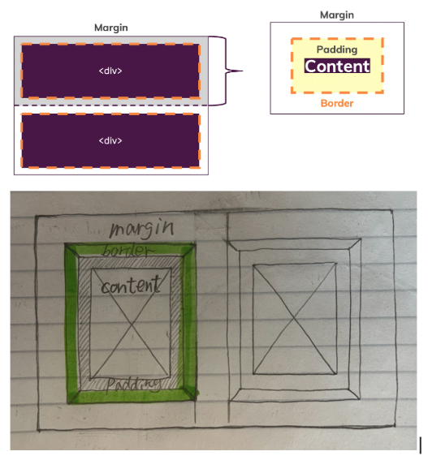

## CSS and Tailwind


### Common CSS Tags

  - [Mdn - CssReference](https://developer.mozilla.org/en-US/docs/Web/CSS/Reference)
  - [cssreference.io](https://cssreference.io/)

<details>
  <summary>"Element interaction with the user" or "visual feedback"</summary>

### Cursor (Mouse pointer style)
| CSS Property           | Description                                | Tailwind Class          |
|------------------------|--------------------------------------------|--------------------------|
| `cursor: default;`     | Default arrow pointer.                     | `cursor-default`         |
| `cursor: pointer;`     | Hand icon, for clickable elements.         | `cursor-pointer`         |
| `cursor: text;`        | I-beam, for text selection.                | `cursor-text`            |
| `cursor: move;`        | Move icon (cross with arrows).             | `cursor-move`            |
| `cursor: wait;`        | Loading spinner or hourglass.              | `cursor-wait`            |
| `cursor: help;`        | Help icon (question mark).                 | `cursor-help`            |
| `cursor: not-allowed;` | Prohibited icon.                           | `cursor-not-allowed`     |
| `cursor: crosshair;`   | Precision cross icon.                      | `cursor-crosshair`       |
| `cursor: auto;`        | Browser default cursor.                    | `cursor-auto`            |
| `cursor: progress;`    | Background task in progress cursor.        | *(Not in Tailwind by default)* |

### Content (`::before` and `::after`)
Used to insert content before or after an element.

```css
.element::before {
  content: "★";
}
```
> Tailwind does not support `content:` directly.

### Opacity
| CSS          | Description         | Tailwind     |
|--------------|---------------------|--------------|
| `opacity: 0.5`| 50% transparency.  | `opacity-50` |

###  Mix Blend Mode
Defines how an element blends with the background.

| CSS Value    | Tailwind Class        |
|--------------|-----------------------|
| `multiply`   | `mix-blend-multiply`  |
| `screen`     | `mix-blend-screen`    |
| `overlay`    | `mix-blend-overlay`   |
| *(etc.)*     | *Supported in Tailwind* |

### List Style
| CSS Property          | Description                               |
|-----------------------|-------------------------------------------|
| `list-style-image`    | Image as bullet point.                    |
| `list-style-position` | Bullet inside or outside.                 |
| `list-style-type`     | Bullet shape: disc, circle, square, etc.  |
| `list-style`          | Shorthand for all the above.              |

Tailwind:
```html
<ul class="list-disc list-inside">...</ul>
```

### Outline
| CSS             | Description                                  |
|-----------------|----------------------------------------------|
| `outline-color` | Color of the outline                         |
| `outline-style` | Style: solid, dashed, etc.                   |
| `outline-width` | Width of the outline                         |
| `outline`       | Shorthand for color + style + width          |

> Outline does **not** take up space (unlike border).

Tailwind:
```html
<button class="outline outline-2 outline-red-500">Click</button>
```
### Pointer Events
| CSS                | Description                  | Tailwind             |
|--------------------|------------------------------|----------------------|
| `pointer-events: none` | Disable mouse events.   | `pointer-events-none`|
| `pointer-events: auto` | Enable mouse events.    | `pointer-events-auto`|

### Resize
Controls if an element (like `<textarea>`) is resizable.

| CSS Value     | Tailwind         |
|---------------|------------------|
| `none`        | `resize-none`    |
| `both`        | `resize`         |
| `vertical`    | `resize-y`       |
| `horizontal`  | `resize-x`       |

### Vertical Align
Aligns inline or table-cell content vertically.

| CSS Value   | Tailwind         |
|-------------|------------------|
| `middle`    | `align-middle`   |
| `top`       | `align-top`      |
| `bottom`    | `align-bottom`   |

### Will-Change
Hints the browser about expected changes.

```css
will-change: transform;
```

Tailwind: *(Use inline style)*
```html
<div style="will-change: transform;"></div>
```
</details>

<details>
  <summary>Background Images</summary>

The `background` property in CSS is a **shorthand property** for setting multiple background-related properties in a single declaration.

## Individual Background Properties

- **`background-attachment`**  
  Defines whether the background image scrolls with the rest of the page or is fixed.

- **`background-clip`**  
  Defines how far the background (color or image) extends within the element.

- **`background-color`**  
  Sets the background color of an element.

- **`background-image`**  
  Specifies one or more background images for an element.

- **`background-origin`**  
  Specifies the origin position of the background image.

- **`background-position`**  
  Specifies the position of the background image.

- **`background-repeat`**  
  Sets whether/how the background image repeats.

- **`background-size`**  
  Specifies the size of the background image:

  - `auto`: Default value. The image is displayed at its original size.
  - `length`: e.g., `100px 200px`
  - `percentage`: e.g., `50% 50%` (of the parent element)
  - `cover`: Scales the image to cover the entire background area. Parts may be clipped.
  - `contain`: Scales the image to fit within the background area. Entire image is visible.

## Shorthand Syntax Example

Instead of writing:
```css
background-image: url('image1.jpg');
background-repeat: no-repeat;
background-attachment: fixed;
background-position: center;
background-size: cover;
background-color: #ff0000;
```

You can write:
```css
background: url('image1.jpg') no-repeat fixed center/cover #ff0000;
```
</details>

<details>
  <summary>SVG Basics</summary>

**SVG** (Scalable Vector Graphics) is used to define vector-based graphics directly within HTML. SVG images are scalable and do not lose quality, making them ideal for web design, logos, icons, and complex illustrations.

### Basic SVG Structure

```html
<svg width="200" height="200" xmlns="http://www.w3.org/2000/svg">
  <!-- Your SVG content goes here -->
</svg>
```

- `width` and `height`: Set the size of the SVG container.
- `xmlns`: Declares the XML namespace for SVG.

### Common SVG Elements

#### `<circle>` - Draws a circle
```html
<circle cx="100" cy="100" r="50" fill="blue" />
```
- `cx` and `cy`: X and Y coordinates of the circle's center.
- `r`: Radius of the circle.
- `fill`: Color of the circle.

#### `<rect>` - Draws a rectangle
```html
<rect x="50" y="50" width="100" height="50" fill="red" />
```
- `x` and `y`: Coordinates of the top-left corner.
- `width` and `height`: Dimensions of the rectangle.

#### `<line>` - Draws a straight line
```html
<line x1="0" y1="0" x2="200" y2="200" stroke="black" stroke-width="2" />
```
- `x1`, `y1`: Starting point of the line.
- `x2`, `y2`: Ending point of the line.
- `stroke`: Line color.
- `stroke-width`: Line thickness.

#### `<ellipse>` - Draws an ellipse
```html
<ellipse cx="100" cy="100" rx="80" ry="40" fill="green" />
```
- `rx` and `ry`: Horizontal and vertical radius.

#### `<polygon>` - Draws a shape with multiple sides
```html
<polygon points="50,150 100,50 150,150" fill="yellow" />
```
- `points`: A list of (x, y) coordinates for the polygon’s corners.

#### `<path>` - Draws complex shapes with commands
```html
<path d="M 10 80 C 40 10, 65 10, 95 80 S 150 150, 180 80" fill="none" stroke="purple" />
```
- The `d` attribute contains a series of commands to draw lines and curves.

### SVG Drawing Example

```html
<!DOCTYPE html>
<html lang="en">
<head>
  <meta charset="UTF-8" />
  <meta name="viewport" content="width=device-width, initial-scale=1.0" />
  <title>SVG Example</title>
</head>
<body>

  <svg width="200" height="200" xmlns="http://www.w3.org/2000/svg">
    <!-- Circle -->
    <circle cx="100" cy="100" r="50" fill="blue" />

    <!-- Rectangle -->
    <rect x="25" y="25" width="50" height="50" fill="red" />

    <!-- Line -->
    <line x1="0" y1="0" x2="200" y2="200" stroke="black" stroke-width="2" />

    <!-- Ellipse -->
    <ellipse cx="100" cy="100" rx="80" ry="40" fill="green" />

    <!-- Polygon -->
    <polygon points="50,150 100,50 150,150" fill="yellow" />

    <!-- Path -->
    <path d="M 10 80 C 40 10, 65 10, 95 80 S 150 150, 180 80" fill="none" stroke="purple" stroke-width="2" />
  </svg>

</body>
</html>
```
### Explanation
- **Circle**: A blue circle centered at (100, 100) with a radius of 50.
- **Rectangle**: A red square at position (25, 25) with dimensions 50x50.
- **Line**: A black diagonal line across the SVG canvas.
- **Ellipse**: A green ellipse centered at (100, 100) with horizontal and vertical radii 80 and 40.
- **Polygon**: A yellow triangle with specified points.
- **Path**: A purple curve created using Bézier curve commands.

> SVG elements can be styled with CSS, animated, and made interactive with JavaScript.
</details>

<details>
  <summary>Color</summary>

  ### Predefined Colors
  CSS comes with a set of named color values that can be used directly, such as:
  - `yellow`, `blue`, `pink`, `lavender`, `cyan`, `purple`, etc.

### RGBA
RGBA stands for **Red, Green, Blue, Alpha**. It's formatted as:
```
rgba(red, green, blue, alpha)
```
- **Red**, **Green**, and **Blue** values range from 0 to 255.
- **Alpha** is the opacity level, where:
  - `1` is fully opaque
  - `0` is fully transparent
  - Values in between represent partial transparency

Example:
```css
rgba(100, 200, 40, 0.5)
```

### RGB
RGB is similar to RGBA but **does not include opacity**. It's formatted as:
```
rgb(red, green, blue)
```
- All values range from 0 to 255
- Defaults to 100% opacity

Example:
```css
rgb(100, 200, 40)
```

###  HEX (Hexadecimal)
Hex is a way of representing colors using hexadecimal (base-16) notation.
- Begins with `#`
- Followed by **six digits** (0–9 and a–f)
- `#000000` is black
- `#ffffff` is white

Example:
```css
#ff5733
```

### Named Color Example
You can use named colors in CSS like this:
```css
#container {
  background-color: darkslateblue;
}
```
</details>

<details>
  <summary>Typography</summary>

  Typography is the art of arranging letters and text to make the copy legible, clear, and visually appealing to the reader. It involves font style, appearance, and structure, which aims to elicit certain emotions and convey specific messages.

### Choosing Type – Fonts Knowledge
- [Google Fonts](https://fonts.google.com/)
- [MyFonts](https://www.myfonts.com/)

### Common CSS Typography Properties

#### Fonts
- `font-family`
- `font-size`
- `font-style`
- `font-variant`
- `font-weight`
- `font` (shorthand)

#### Spacing and Layout
- `letter-spacing`
- `line-height`
- `text-align`
- `text-decoration`
- `text-indent`
- `text-overflow`
- `text-shadow`
- `text-transform`
- `white-space`
- `word-break`
- `word-spacing`

</details>

<details>
  <summary>Sizing & Units</summary>

  ### Key Properties
- `width`, `height`, `min-width`, `max-width`, `min-height`, `max-height`
- These properties set size constraints for elements

### Why Use Them?
- **Responsive Design**: Keep elements looking good across screen sizes
- **Layout Consistency**: Prevent items from getting too small or large
- **Content Overflow Management**: Handle dynamic content gracefully

## Units Overview

### Pixels (`px`)
- 100px ≈ 1 inch (depends on screen)
- Use when fixed size is needed and doesn't need to scale

### Percentages (`%`)
- Relative to the parent element's size
- Useful for responsive scaling

### rem vs em
- `1rem = 16px` (relative to `<html>` root font size)
- `1em = 16px` by default (relative to **current** element's font size)

#### When to Use
- **rem**: Global consistency, typography scale, paddings/margins
- **em**: Local/component-level scaling, nested flexibility

#### Advantages
1. **Scalability & Accessibility**
   - rem/em allow size scaling with root font-size or user settings
   - Great for accessibility and responsive designs

2. **Consistency**
   - rem ensures a consistent visual hierarchy
   - em provides proportional scaling within components

3. **Maintainability**
   - Adjust root font-size to scale rem-based values globally
   - em units make components flexible for reuse

### Viewport Units (`vh`, `vw`)
- `vh` = 1% of viewport height
- `vw` = 1% of viewport width
- ⚠️ Often buggy and not recommended unless used carefully


## Best Practices

### Min/Max Width
- Always pair `width` with `min-width` and `max-width`
- Use `%` or `rem` for `width`, and `px` limits for safety
- Works for `height` as well

### The Containing Block
- The parent element used for calculating `%` units
- Depends on positioning (`static`, `relative`, `absolute`, etc.)
- Can be the closest ancestor or the viewport

### 100% Height Issue
- `height: 100%` won’t work unless **all ancestors** have defined height
- Fix: Set `height: 100%` on body/html or use `vh`
- Use `position: absolute/fixed` when needed

## Which Units Should I Choose?
- Use `rem` for consistent, scalable layout design
- Use `em` for flexible, nested components
- Use `%` for responsive width/height
- Use `px` for precise control when necessary
- Avoid over-relying on `vh`/`vw` unless confident
</details>

<details>
  <summary>Centering</summary>

Centering elements in CSS can be done in a variety of ways depending on the type of layout (block, flex, grid, or inline elements) and whether you are centering horizontally, vertically, or both.

## 1. Centering Block Elements Horizontally

For block-level elements like `div`, centering horizontally is often done using `margin: auto`.

```html
<div class="centered-box">I'm a centered box</div>
```

```css
.centered-box {
  width: 50%;
  margin: 0 auto;
  background-color: lightblue;
  text-align: center;
}
```

## 2. Centering Inline Elements Horizontally

Use `text-align: center` on the parent.

```html
<div class="parent">
  <span class="centered-text">Centered Text</span>
</div>
```

```css
.parent {
  text-align: center;
}
```

## 3. Centering with Flexbox

```html
<div class="flex-container">
  <div class="centered-item">I'm centered!</div>
</div>
```

```css
.flex-container {
  display: flex;
  justify-content: center;
  align-items: center;
  height: 100vh;
  background-color: lightgray;
}
.centered-item {
  background-color: lightblue;
  padding: 20px;
}
```

## 4. Centering with CSS Grid

```html
<div class="grid-container">
  <div class="grid-item">I'm centered with Grid!</div>
</div>
```

```css
.grid-container {
  display: grid;
  place-items: center;
  height: 100vh;
  background-color: lightgray;
}
.grid-item {
  background-color: lightblue;
  padding: 20px;
}
```

## 5. Absolute Centering with Transform

```html
<div class="absolute-container">
  <div class="absolute-centered">I'm absolutely centered!</div>
</div>
```

```css
.absolute-container {
  position: relative;
  height: 100vh;
  background-color: lightgray;
}
.absolute-centered {
  position: absolute;
  top: 50%;
  left: 50%;
  transform: translate(-50%, -50%);
  background-color: lightblue;
  padding: 20px;
}
```

## 6. Vertically Center Single-Line Text with Line-Height

```html
<div class="centered-text-box">Centered Text</div>
```

```css
.centered-text-box {
  height: 200px;
  line-height: 200px;
  text-align: center;
  background-color: lightblue;
}
```

## Summary

- **Block elements**: Use `margin: auto`.
- **Flexbox**: Use `justify-content` and `align-items`.
- **Grid**: Use `place-items: center`.
- **Absolute Positioning**: Combine with `transform`.
- **Text**: Use `text-align` and `line-height`.


## CSS Transform Explained

```css
transform: translate(50px, 100px);      /* Move along x and y axes */
transform: rotate(45deg);               /* Rotate element 45 degrees */
transform: scale(1.5, 1.5);             /* Scale by 1.5 on x and y */
transform: skew(30deg, 20deg);          /* Skew on x and y axes */
transform: translate(50px, 50px) rotate(45deg) scale(1.2); /* Combined transforms */
transform-origin: top left;            /* Set transform origin */
```

## Extra Snippets

### Horizontally center block elements

```css
.potato {
  margin: 0 auto;
}
```

### Vertically center with absolute + transform

```css
#big-potato {
  position: absolute;
  top: 50%;
  left: 50%;
  transform: translate(-50%, -50%);
}
```
</details>


<details>
  <summary>CSS Selectors</summary>

This document provides a comprehensive reference of CSS selectors, pseudo-classes, attributes, and common layout techniques.

## CSS Selectors Summary

| Selector | Example | Description |
|----------|---------|-------------|
| `.class` | `.intro` | Selects elements with class="intro" |
| `.class1.class2` | `.name1.name2` | Selects elements with both class names |
| `.class1 .class2` | `.name1 .name2` | Selects `.class2` inside `.class1` |
| `#id` | `#firstname` | Selects element with id="firstname" |
| `*` | `*` | Selects all elements |
| `element` | `p` | Selects all `<p>` elements |
| `element.class` | `p.intro` | Selects `<p>` with class="intro" |
| `element, element` | `div, p` | Selects all `<div>` and `<p>` elements |
| `element element` | `div p` | Selects `<p>` inside `<div>` |
| `element > element` | `div > p` | Selects direct child `<p>` of `<div>` |
| `element + element` | `div + p` | Selects `<p>` immediately after `<div>` |
| `element1 ~ element2` | `p ~ ul` | Selects every `<ul>` preceded by a `<p>` |

## Attribute Selectors

- `[target]`: Elements with target attribute
- `[target="_blank"]`: Exact match
- `[title~="flower"]`: Contains word "flower"
- `[lang|="en"]`: Starts with "en"
- `[href^="https"]`: Begins with "https"
- `[href$=".pdf"]`: Ends with ".pdf"
- `[href*="w3schools"]`: Contains "w3schools"

## Pseudo-Classes and Elements

Examples include:
- `:hover`, `:focus`, `:active`
- `:first-child`, `:last-child`, `:nth-child(n)`
- `::before`, `::after`, `::first-letter`
- `:checked`, `:disabled`, `:enabled`
- `:read-only`, `:read-write`
- `:visited`, `:link`, `:target`
- `:not()`, `:empty`, `:in-range`, `:out-of-range`
- `:root`, `::selection`, `::marker`

## Inheritance
Child elements inherit properties from parent elements. If a child does not define its own value for a property, it inherits from the parent.


#### Tag Selectors
```css
h2 {
  color: red;
  width: 20px;
  height: 40px;
}
```
- All elements of type `h2` in your HTML will be affected.


#### Class Selectors
**Class** — Apply a set of rules to multiple elements on the page.

- **HTML**: Add the `class` attribute to the opening tag.
- **CSS**: Use a period `.` in front of the class name as a selector.

**Example:**
```html
<p class="green">Green text</p>
<p class="green">Green text 2</p>
<div class="green">Also green</div>
```

```css
.green {
  color: green;
}
```

#### ID Selectors
**ID** — Apply a set of rules to only one distinct element on the page.

- **HTML**: Add the `id` attribute to the opening tag.
- **CSS**: Use a hashtag `#` in front of the ID name as a selector.

**Example:**
```html
<p id="blue">Blue text</p>
```

```css
#blue {
  color: blue;
}
```
## Grouping Selectors (Comma `,`)

Use a comma `,` to apply the same CSS to multiple elements:

```css
h1, h2, h3 {
  /* All h1, h2, h3 elements will be affected */
}
```

```css
h1, h2, #special-heading {
  color: blue;
  background: gray;
}
```

You can use this to reduce code repetition.

## The Universal Selector `*`

The universal selector `*` targets **all elements** in the document:

```css
* {
  margin: 0;
  padding: 0;
}
```

⚠️ This can be overly powerful and is not recommended for most cases.

#### Alternative to Universal Selector

Instead of using `*`, you can apply global styles to the `html` element. Many properties, such as `font-family`, are inherited:

```css
html {
  font-family: "Comic Sans";
}
```

## AND Selectors (Multiple Conditions)

Apply styles only when an element matches **all** conditions:

```css
h1.my-title.red-text {
  color: red;
  font-size: 50px;
}
/* Only h1s with both classes .my-title and .red-text */
```

## Selecting Elements with Multiple Classes

```html
<p class="green big">Lorem</p>
<p class="big">Ipsum</p>
```

```css
.green.big {
  color: green;
  font-size: 64px;
}
```

## Hierarchical Selectors (Descendant Selectors)

Use a **space** to apply styles to descendants of a selector:

```css
.text h1 {
  color: blue;
}
/* All h1s inside elements with class "text" */
```

```css
.text {
  width: 2rem;
}

.text .pretty {
  color: green;
}

.text .ugly {
  width: 4rem;
}
```

- `.text` has width `2rem` and default black color.
- `.text .pretty` has green text and width `2rem`.
- `.text .ugly` has width `4rem` and default color.

## Selecting Nested Elements

```html
<div id="jay">
  <p class="park">Jay Park <3</p>
</div>
```

```css
#jay .park {
  font-size: 32px;
}
/* Targets .park paragraphs inside #jay */
```

## CSS Combinators and Class Selectors Example

This example demonstrates how to use **multiple CSS classes**, **combined selectors**, and **combinators** in HTML and CSS.

### HTML Structure

```html
<body>
   <nav>
       <a href="#intro" class="active">Intro</a>
       <a href="#outro">Outro</a>
   </nav>

   <section id="intro" class="main-section highlighted">
       <p>This is the intro section.</p>
   </section>

   <section id="outro" class="main-section">
       <p>This is the outro section.</p>
   </section>
</body>
```

### CSS Styling

```css
body {
   font-family: sans-serif;
}

nav {
   margin-bottom: 16px;
   background: #fa923f;
   padding: 8px 0;
}

a {
   text-decoration: none;
   color: white;
   margin: 10px;
}

a.active {
   color: #521751;
}

a {
   color: blue;
}

.main-section {
   height: 800px;
   border: 1px solid #ccc !important;
   padding: 16px;
}

.highlighted {
   border: 2px solid #ea5c24;
   height: 200px;
}
```

### Notes

- `a.active`: Targets `<a>` elements with class `active`.
- `.main-section.highlighted`: Applies both `main-section` and `highlighted` styles to the same section.
- Order of CSS matters: the later `a { color: blue; }` overrides the previous `a { color: white; }` unless more specific.
- `!important`: Forces the border style even if other styles conflict.
- Combined classes can refine layout and design without duplication.


### !important Keyword

Used to force rule priority:
```css
p {
  color: red !important;
}
```

## `calc()` Usage

Example: `calc(50% - 240px)` centers an element of fixed width horizontally.

## Pseudo-Class Example

```css
a:link { color: red; }
a:visited { color: green; }
a:hover { color: magenta; }
a:active { color: blue; }
```

## Button Interaction Example

```html
<button class="button">CHOOSE PLAN</button>
```

```css
.button {
  background: #0e4f1f;
  color: white;
  padding: 8px;
  border-radius: 8px;
  cursor: pointer;
}

.button:hover, .button:active {
  background: white;
  color: #0e4f1f;
}
```
## border-radius: 50%

Used to make circles or rounded elements. Can specify 1-4 values or use percentages or pixel units.

This document is a comprehensive reference to CSS syntax, designed to assist with everyday frontend work.
</details>

<details>
  <summary>Box Model</summary>
  
## 📦 Box Model Components

The **Box Model** includes the following layers (from innermost to outermost):

1. **Content** – The actual content of the box (e.g., text, images).
2. **Padding** – Space between content and the border.
3. **Border** – Surrounds the padding (if any) and content.
4. **Margin** – Space outside the border.




## Dimensions & Spacing

### Width & Height
```css
width: 300px;
height: auto;
```

### Padding
```css
padding: 15px;
/* or specify each side individually */
padding-top: 15px;
padding-right: 15px;
padding-bottom: 15px;
padding-left: 15px;
```

### Border
```css
border: 10px solid skyblue;
/* or specify each side */
border-top-width: 10px;
border-right-style: solid;
border-left-color: skyblue;
...
```

### Margin
```css
margin: 30px;
/* or specify each side */
margin-top: 30px;
margin-right: 30px;
margin-bottom: 30px;
margin-left: 30px;
```

## Additional Properties

- `box-shadow`: Adds shadow around the box.
- `box-sizing`: Defines whether `width/height` include padding and border.
- `max-width`, `max-height`, `min-width`, `min-height`: Set size constraints.
- `mix-blend-mode`: Defines how the box blends with background.


## HTML Example

```html
<div class="box">
  Welcome to WDD!
</div>
<div class="box">
  Homework 3 will be released tonight.
</div>
```

### CSS

```css
.box {
   background-color: white;
   width: 300px;
   padding: 15px;
   border: 10px solid skyblue;
   margin: 30px;
}
```

> We can have different amounts of spacing on different sides of the box. The four sides are: **top, right, bottom, and left**.

## Clockwise Shorthand Example
```css
/* top right bottom left */
padding: 16px 16px 16px 16px;
margin: 16px 16px 16px 16px;
```


## Height & Width Values

```css
width: 100%;
height: 100%;
width: 300px;
height: 128px;
```
</details>

<details>
  <summary>Layout</summary>
  
The `display` property in CSS determines how an element is displayed in the document layout. It defines the display behavior of an HTML element.

### 1. `block`
- Element takes up the full width.
- Always starts on a new line.
- Example: `<div>`, `<section>`, `<p>`

```css
display: block;
```

### 2. `inline`
- Element does **not** start on a new line.
- Only takes up as much width as needed.
- Example: `<span>`, `<a>`, `<strong>`

```css
display: inline;
```

### 3. `inline-block`
- Similar to `inline`, but allows width and height to be set.
```css
display: inline-block;
```

### 4. `none`
- Hides the element (it is removed from the layout flow).

```css
display: none;
```

### 5. `flex`
- Enables Flexbox layout.
- Used for one-dimensional layouts (horizontal or vertical).

```css
display: flex;
```

### 6. `grid`
- Enables Grid layout.
- Used for two-dimensional layouts.

```css
display: grid;
```

### 7. `inline-flex`, `inline-grid`
- Same as `flex` or `grid` but the element itself behaves like `inline`.

```css
display: inline-flex;
display: inline-grid;
```

Example
```css
.container {
  display: flex;
  justify-content: center;
  align-items: center;
}
```

```html
<div class="container">
  <div class="item">Centered Item</div>
</div>
```

Notes
- The default `display` value depends on the HTML element (e.g., `div` is `block`, `span` is `inline`).
- `display` is often used with layout systems like Flexbox or CSS Grid to build responsive and structured interfaces.

## Float
The `float` property in CSS is used to position an element to the left or right of its container, allowing text and inline elements to wrap around it.
This property was commonly used for layouts before CSS Flexbox and Grid. Use it carefully to avoid complex layout problems.

## Clear
The `clear` property is used to move an element below any preceding floated elements.

## Columns
- `column-count`: Defines the number of columns in the element.
- `column-gap`: Defines the space between columns.
- `column-width`: Defines the width of the columns.

## Overflow
- `overflow`: Controls content spilling over its container. Options: `visible`, `hidden`, `scroll`, `auto`.
- `overflow-x`: Controls horizontal overflow.
- `overflow-y`: Controls vertical overflow.
- `overflow-wrap`: Controls if long words are broken and wrap to the next line.

## Display Types
### Inline
Displays the element inline, like a `<span>`. Height and width properties do not apply.
Inline elements sit next to each other on the same line. Common use case: horizontally aligned buttons.

### Block
A block element starts on a new line and takes up the full width available by default.

### Display Property Examples
- `display: block;`: Converts inline elements to block and allows setting width and height.
- `display: inline;`: Converts block elements to inline.
- `display: inline-block;`: Keeps block layout but allows elements to sit side-by-side.
- `display: none;`: Removes the element completely from layout.
- `visibility: hidden;`: Makes the element invisible but it still occupies space.

## Block-Level Elements
These elements start on a new line and take up full width:
```html
<div>...</div>
<p>...</p>
<h1>...</h1>
<blockquote>...</blockquote>
<article>...</article>
<section>...</section>
<nav>...</nav>
```

## Inline Elements
These elements do not start on a new line and take only as much width as needed:
```html
<span>...</span>
<a href="#">...</a>

<strong>...</strong>
<em>...</em>
<code>...</code>
```

## Vertical Align
Applying the Display Property & Styling Our Navigation Bar

#### `text-decoration`
This CSS property specifies the decoration added to text, such as underlines, overlines, or line-throughs.  
Example:
```css
a {
  text-decoration: none; /* removes the underline from links */
}
```

#### `vertical-align`
This property sets the vertical alignment of an inline or table-cell element. It aligns the element relative to its surrounding content or its parent element.

Example:
```css
img {
  vertical-align: middle;
}
```

Used commonly to align text and images within the same line.


## CSS Box Example
Use display and float
The float property in CSS is used to position an element to the left or right of its container, allowing text and inline elements to wrap around it. This property can be useful for creating layouts, especially before the advent of CSS Flexbox and Grid. However, it should be used judiciously to avoid complex layout issues.
```css
.box {
   display: inline-block;
   float: left;
   background-color: white;
   width: 300px;
   padding: 15px;
   border: 10px solid skyblue;
   padding: 30px;	
}
```
</details>

<details>
  <summary>Positioning</summary>

## Positioning
- position	Defines the position behavior of the element
- top		Defines the position of the element according to its top edge
- bottom	Defines the position of the element according to its bottom edge
- left		Defines the position of the element according to its left edge
- right		Defines the position of the element according to its left edge


## `position: static`
This is the default positioning. Elements follow the normal document flow.
- Block boxes stack vertically from the top of the containing block and take up full width unless otherwise specified.
- Inline elements flow horizontally inside block containers and wrap to the next line when reaching the container's edge.
- Static elements are not affected by `top`, `bottom`, `left`, and `right`.

```html
<div class="container">
  <div class="a"></div>
  <div class="b"></div>
  <div class="c"></div>
</div>
```
## `position: relative`
The element is positioned relative to its **default static position**.
- It retains its place in the normal flow but visually offsets itself.
- The offset does not affect surrounding elements.

```css
.b {
  position: relative;
  top: 20px;
  left: 30px;
}
```

## `position: fixed`
The element is removed from normal flow and positioned relative to the **viewport**.
- It stays fixed in the same position on the screen even when scrolling.
- Does not reserve space in the layout.
- Must define `width` and `height` for inline elements.
- Uses `top`, `bottom`, `left`, `right` for placement.


## `position: absolute`
The element is removed from normal flow and positioned relative to the **nearest positioned ancestor** (non-static).
- If no such ancestor exists, it's positioned relative to the document body.
- Does not reserve space; next elements replace its place.
- Commonly used for layering with `z-index`.

```css
.container {
  position: relative;
}
.b {
  position: absolute;
  right: 0px;
  top: 0px;
}
```

## `position: sticky`
Sticky positioning behaves like `relative` until a scroll threshold is met, then becomes `fixed`.
- It toggles between `relative` and `fixed` based on scroll position.
- Uses `top`, `bottom`, `left`, `right` to define sticky threshold.


## `z-index`
- Controls the stack order of elements.
- Elements with higher `z-index` values appear above those with lower ones.

```css
.a {
  z-index: 1;
}
.b {
  position: relative;
  left: 50px;
  bottom: 20px;
  z-index: 0; /* default */
}
```
</details>


<details>
  <summary>Flexbox</summary>

Flexbox is a powerful CSS layout module that allows responsive alignment and distribution of space among items in a container—even when their size is unknown or dynamic.

### Properties for the Parent (Flex Container)

#### `display`
Defines a flex container. Use `flex` or `inline-flex`. It enables a flex context for all direct children.

```css
display: flex;        /* block-level flex container */
display: inline-flex; /* inline-level flex container */
```

#### `flex-direction`
Defines the **main axis** of the flex container. Determines how flex items are placed.

```css
flex-direction: row;           /* horizontal (left to right) */
flex-direction: row-reverse;   /* horizontal (right to left) */
flex-direction: column;        /* vertical (top to bottom) */
flex-direction: column-reverse;/* vertical (bottom to top) */
```

#### `flex-wrap`
By default, flex items try to fit on one line. Use this property to allow wrapping.

```css
flex-wrap: nowrap;       /* all items on one line (default) */
flex-wrap: wrap;         /* wrap items to next line */
flex-wrap: wrap-reverse; /* wrap in reverse direction */
```

#### `flex-flow`
Shorthand for `flex-direction` and `flex-wrap`.

```css
flex-flow: column wrap; /* same as flex-direction: column; flex-wrap: wrap; */
```

## Fleshing out by flexing
```html
<div id="best-box"> 
  <div class="child">child</div>
  <div class="child">child</div>
</div>
```

```css
#best-box {
  display: flex;
  flex-direction: row;
}
```

### Flex direction: row
```css
#best-box {
  display: flex;
  flex-direction: row;
}
```

### Flex direction: row-reverse
```css
#best-box {
  display: flex;
  flex-direction: row-reverse;
}
```

### Flex direction: column
```css
#best-box {
  display: flex;
  flex-direction: column;
}
```

### Flex direction: column-reverse
```css
#best-box {
  display: flex;
  flex-direction: column-reverse;
}
```

## Nested Flexboxes Example

```html
<div id="best-box">
  <div class="child">
    <p>1</p>
    <p>2</p>
  </div>
  <div class="child">
    <p>3</p>
    <p>4</p>
  </div>
</div>
```

```css
#best-box {
  display: flex;
  flex-direction: row;
}

.child {
  display: flex;
  flex-direction: row;
}
```
## Flexbox Axes with `flex-direction: row`
- **Main axis**: Left to right
- **Cross axis**: Top to bottom

### Flexbox Properties for Children (Flex Items)

This document summarizes key CSS flexbox properties, especially for flex items (children elements), translated into English.


#### ✅ `justify-content`

Defines the alignment along the **main axis** (horizontal by default). It helps distribute leftover space when:
- Items are inflexible, or
- Flexible but have reached their maximum size.

It also influences item alignment when they **overflow the container**.

**Common and safe values**:
- `flex-start`
- `flex-end`
- `center`

**Syntax**:
```css
.container {
  justify-content: flex-start | flex-end | center | space-between | space-around | space-evenly | start | end | left | right [safe | unsafe];
}
```
Examples

#### Centering items:
```css
#best-box {
  display: flex;
  flex-direction: row;
}
.child {
  display: flex;
  flex-direction: row;
  justify-content: center;
}
```
#### Distributing space between items:
```css
.child {
  display: flex;
  flex-direction: row;
  justify-content: space-around;
}
```
#### Summary
Distributes **extra space** along the main flex-direction axis.

🔗 [CSS-Tricks Guide to Flexbox](https://css-tricks.com/snippets/css/a-guide-to-flexbox/)

#### `align-items`

Defines how flex items are aligned along the **cross axis** (vertical by default).

**Syntax**:
```css
.container {
  align-items: stretch | flex-start | flex-end | center | baseline | first baseline | last baseline | start | end | self-start | self-end [safe | unsafe];
}
```

Examples

#### Centering items:
```css
.child {
  display: flex;
  flex-direction: row;
  align-items: center;
}
```

#### Aligning to flex-start:
```css
.child {
  display: flex;
  flex-direction: row;
  align-items: flex-start;
}
```

#### Aligning to flex-end:
```css
.child {
  display: flex;
  flex-direction: row;
  align-items: flex-end;
}
```

### Summary
Aligns **children** along the **cross axis**.


### justify-content` + `align-items` Combined

Example:
```css
.child {
  display: flex;
  flex-direction: row;
  justify-content: flex-end;
  align-items: flex-end;
}
```

Another example:
```css
.child {
  display: flex;
  flex-direction: row;
  justify-content: space-between;
  align-items: center;
}
```

#### `align-content`

Aligns flex **lines** along the cross axis when there’s extra space, similar to how `justify-content` aligns items in the main axis.

**Syntax**:
```css
.container {
  align-content: flex-start | flex-end | center | space-between | space-around | space-evenly | stretch | start | end | baseline | first baseline | last baseline [safe | unsafe];
}
```


#### `gap`, `row-gap`, `column-gap`

Defines **space between flex items**, not including the outer edges.

**Syntax**:
```css
.container {
  display: flex;
  gap: 10px;
  gap: 10px 20px; /* row-gap column-gap */
  row-gap: 10px;
  column-gap: 20px;
}
```

This README translates and explains common flexbox properties for practical CSS layout usage.

Example 1: Basic Flex Container

```html
<ul class="flex-container">
  <li class="flex-item">1</li>
  <li class="flex-item">2</li>
  <li class="flex-item">3</li>
  <li class="flex-item">4</li>
  <li class="flex-item">5</li>
  <li class="flex-item">6</li>
</ul>
```

```css
.flex-container {
  /* Create a flex layout context */
  display: flex;
  /* Set direction and allow wrapping */
  flex-flow: row wrap;
  /* Distribute space around items */
  justify-content: space-around;
  padding: 0;
  margin: 0;
  list-style: none;
}

.flex-item {
  background: tomato;
  padding: 5px;
  width: 200px;
  height: 150px;
  margin-top: 10px;
  line-height: 150px;
  color: white;
  font-weight: bold;
  font-size: 3em;
  text-align: center;
}
```

Example 2: Responsive Navigation Menu

```html
<ul class="navigation">
  <li><a href="#">Home</a></li>
  <li><a href="#">About</a></li>
  <li><a href="#">Products</a></li>
  <li><a href="#">Contact</a></li>
</ul>
```

```css
.navigation {
  display: flex;
  flex-flow: row wrap;
  justify-content: flex-end;
  list-style: none;
  margin: 0;
  background: deepskyblue;
}

.navigation a {
  text-decoration: none;
  display: block;
  padding: 1em;
  color: white;
}

.navigation a:hover {
  background: #1565C0;
}

@media all and (max-width: 800px) {
  .navigation {
    justify-content: space-around;
  }
}

@media all and (max-width: 600px) {
  .navigation {
    flex-flow: column wrap;
    padding: 0;
  }

  .navigation a {
    text-align: center;
    padding: 10px;
    border-top: 1px solid rgba(255, 255, 255, 0.3);
    border-bottom: 1px solid rgba(0, 0, 0, 0.1);
  }

  .navigation li:last-of-type a {
    border-bottom: none;
  }
}
```

Example 3: Responsive Layout with Header, Footer, Main, and Asides

```html
<div class="wrapper">
  <header class="header">Header</header>
  <article class="main">...</article>
  <aside class="aside aside-1">Aside 1</aside>
  <aside class="aside aside-2">Aside 2</aside>
  <footer class="footer">Footer</footer>
</div>
```

```css
.wrapper {
  display: flex;
  flex-flow: row wrap;
  font-weight: bold;
  text-align: center;
}

.wrapper > * {
  padding: 10px;
  flex: 1 100%;
}

.header {
  background: tomato;
}

.footer {
  background: lightgreen;
}

.main {
  text-align: left;
  background: deepskyblue;
}

.aside-1 {
  background: gold;
}

.aside-2 {
  background: hotpink;
}

@media all and (min-width: 600px) {
  .aside {
    flex: 1 0 0;
  }
}

@media all and (min-width: 800px) {
  .main {
    flex: 3 0px;
    order: 2;
  }

  .aside-1 {
    order: 1;
  }

  .aside-2 {
    order: 3;
  }

  .footer {
    order: 4;
  }
}

body {
  padding: 2em;
}
```
</details>


