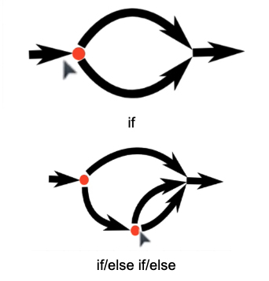
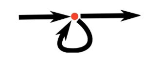

# Introduction to JavaScript
<details>
  <summary>JavaScript Basics & Linking Guide</summary>

## Multi-line Comments in JavaScript
```javascript
/*
  This is a multi-line
  comment in JavaScript
*/
```

---

## Where JavaScript Runs
JavaScript can run in many environments:
- Web browsers
- Servers (Node.js)
- Robotics
- Many other platforms use JavaScript as a scripting environment.

---

## Naming Conventions for Variables
- Must begin with a letter (a–z), `_`, or `$`
- **Cannot** start with a number
- **Cannot** use reserved keywords
- **Do not** start variable names with capital letters

### Popular Naming Styles:
- `camelCase` – ✔️ Most common style
- `snake_case` – OK in some cases
- `kebab-case` – ❌ Not allowed in JavaScript variable names

---

## JavaScript Usage
Just like HTML and CSS define structure and appearance, JavaScript defines **behavior**.

JavaScript makes websites interactive by reacting to user actions.

### Examples:
- Pop-up dialogs
- Image carousels
- Expanding/collapsing menus
- Backend logic using Node.js

---

## JavaScript Keywords (Reserved Words)
```
break, case, catch, class, const, continue, debugger, default,
delete, do, else, export, extends, finally, for, function, if,
import, in, instanceof, new, return, super, switch, this, throw,
try, typeof, var, void, while, with, yield
```

---

## How to Link JavaScript to HTML
1. Create a file, e.g., `script.js`
2. Add this line **just before the closing `</body>`** tag:
```html
<script src="index.js" defer></script>
```

### `<script>` vs `<script defer>`
- **Without `defer`**:
  - HTML parsing is paused when the script is encountered
  - The script is executed immediately
  - If the script accesses DOM elements that haven't loaded, you may get errors like:
    `Cannot read properties of null`

- **With `defer`**:
  - Script is downloaded asynchronously
  - Executed **after** the HTML is fully parsed
  - Safer when manipulating the DOM

---

## How to Run JavaScript and Use `console.log()`
`console.log()` prints output to the browser's developer console.

### 1. Using the Browser Console
- Open Chrome/Firefox
- Right-click → Inspect → Console tab
- Type:
```javascript
console.log("Hello, World!");
```

### 2. Using an HTML File
```html
<!DOCTYPE html>
<html>
<head>
  <title>Console Log Test</title>
</head>
<body>
  <script>
    console.log("Hello, World!");
  </script>
</body>
</html>
```
Open this file in your browser and check the Console.

### 3. Using Node.js
- Save to a file: `app.js`
```javascript
console.log("Hello, World!");
```
- Run in terminal:
```bash
node app.js
```

### 4. Using Online JavaScript Editors
Try:
- https://jsfiddle.net
- https://codepen.io
- https://jsbin.com

Paste your code and open the Console tab to see the output.
</details>


<details>
  <summary>Variables – Declaration, Initialization, and Scope</summary>

## Basics of Variables
Variables have **two key stages**:

1. **Declaration** – tells the program that a variable exists
2. **Initialization** – assigns a value (e.g., number, text) to that variable

**Example from math:**
> “Let k be 5”  
- Declaration → `let k`
- Initialization → `= 5`

Most variables in JavaScript can be **re-declared** and/or **re-assigned**, depending on how they are defined.

```js
let name = "Joe";
let age = 20;
```

Each variable has a **scope** – the environment where it holds its value.
In JavaScript, you can declare variables using `var`, `let`, and `const`, each with different behaviors.


## `var`
- Can be **re-declared** and **re-assigned**
- Function scoped
- Oldest way to declare variables

```js
var cohort = 'web49';
var cohort = 'web50'; // OK
cohort = 'web51';     // OK
console.log(cohort);  // 'web51'
```


## `let`
- Cannot be re-declared in the same scope
- Can be re-assigned
- Block scoped (inside `{ }`)
- Introduced in ECMAScript 6 (ES6)

We **prefer using `let`** for variables that may change over time. Its block scope prevents unintended modification or leakage outside the intended block.

```js
let myNumber = 1;
myNumber = 2; // OK
console.log(myNumber); // 2
```

## `const`
- Cannot be re-declared
- Cannot be re-assigned
- Block scoped
- Introduced in ES6

Use `const` when the value should remain constant throughout the script.

```js
const myNumber = 1;
myNumber = 2; // ❌ ERROR: Assignment to constant variable
```


## Summary Table
| Keyword | Re-declarable | Re-assignable | Scope        | Notes                     |
|---------|---------------|---------------|--------------|---------------------------|
| `var`   | ✅ Yes         | ✅ Yes         | Function     | Avoid in modern code      |
| `let`   | 🚫 No          | ✅ Yes         | Block        | Recommended for variables |
| `const` | 🚫 No          | 🚫 No          | Block        | Use for constants         |


## Resources
- [MDN - var, let, and const](https://developer.mozilla.org/en-US/docs/Web/JavaScript/Reference/Statements/var)
- [JavaScript Scope](https://developer.mozilla.org/en-US/docs/Glossary/Scope)
- [ES6 Guide](https://www.ecma-international.org/ecma-262/6.0/)
</details>


<details>
  <summary>Data Types</summary>

## Number
- Used for numeric values (both integers and floating-point).
- Unlike some languages that differentiate between integers (e.g., 1, 2, 3) and floats (e.g., 1.2, 3.14), **JavaScript has only one number type: `Number`**.
- Example:
  ```js
  const num1 = 42;
  const num2 = 3.14;
  const num3 = -7;
  ```

## String
- Use `" "`, `' '`, or backticks `` ` ` ` to define a string.
- Strings are everywhere in programming—used for names, addresses, product titles, cities, etc.

### String Concatenation
- You can use the `+` operator to combine strings.
- Don’t forget to include spaces if needed!
  ```js
  const firstName = "Jonathan";
  const lastName = "Ma";
  const sentence = "Hello " + firstName + " " + lastName + "! How are you!?";

  console.log(sentence);  // Hello Jonathan Ma! How are you!?
  ```

### Template Literals (ES6+)
- Use backticks `` ` `` and `${}` to inject variables.
  ```js
  const sentenceWithTemplate = `Hello ${firstName} ${lastName}! How are you!?`;
  console.log(sentenceWithTemplate);
  ```

### Function Example
- Traditional string concatenation:
  ```js
  function formatName(firstName, lastName) {
    return lastName + ", " + firstName;
  }

  console.log(formatName("John", "Doe")); // Doe, John
  ```

- Using template literals:
  ```js
  function formatName(firstName, lastName) {
    return `${lastName}, ${firstName}`;
  }

  console.log(formatName("John", "Doe")); // Doe, John
  ```


## Boolean
- Represents a logical value: `true` or `false`.
- Example: a light switch
  ```js
  const lightIsOn = true;
  ```

## Undefined
- A variable that has been declared but not assigned a value.
  ```js
  let x;
  console.log(x); // undefined
  ```

## Null
- Represents an intentional absence of any object value.
  ```js
  let x = null;
  ```

## Symbol
- A unique and immutable data type used as identifiers for object properties.
  ```js
  let sym = Symbol('description');
  ```

## Object
- Used to store collections of data and more complex entities.
- Includes arrays, functions, and other objects.
  ```js
  const person = { name: "Alice", age: 25 };
  const list = [1, 2, 3];
  const greet = function() {
    console.log("Hello!");
  };
  ```
</details>

<details>
  <summary>Operators and Logic</summary>

## Assignment and Equality Operators

- Use `=` when assigning values to variables.
  ```js
  let username = 'Ade';
  username = 'Sheeba';
  ```

- Use `==` for equality checks when **type coercion is acceptable**.  
  ⚠️ Not recommended due to possible unexpected results.
  ```js
  '5' == 5  // true
  ```

- Use `===` for **strict equality** to ensure both value and type are the same. ✅ Best practice.
  ```js
  '5' === 5  // false
  5 === 5    // true
  ```

- Use `!==` for **strict inequality** (not equal by value and type).


## Logical Operators

| Operator | Meaning   | Example                        |
|----------|-----------|--------------------------------|
| `||`     | OR        | `true || false` → `true`       |
| `&&`     | AND       | `true && false` → `false`      |
| `!==`    | Not equal | `5 !== '5'` → `true`           |


## Order of Operations: PEMDAS
Just like in math, JavaScript follows the order of operations:

1. **Parentheses** `()`
2. **Exponents** `**`
3. **Multiplication / Division** `* /`
4. **Addition / Subtraction** `+ -`


## Login Example (Corrected & Explained)

```js
let username = 'Ade';
username = 'Sheeba';

let password = 'fluffyKittens';
password = 'unicorn';

if (password === 'unicorn' || (username === 'Ade' && password === 'cutePuppies')) {
  console.log('You\'ve logged in successfully');
}
```

### ✅ What This Does:
- If the password is `'unicorn'` OR
- If the username is `'Ade'` AND the password is `'cutePuppies'`
→ Then print: `You've logged in successfully`

⚠️ Always use parentheses `()` to make logic groups clear and avoid confusion.


## Summary
- Use `=` for assignment.
- Prefer `===` over `==` for clarity and safety.
- Use logical operators `||` (or), `&&` (and), and `!==` (not equal) appropriately.
- Group logical conditions with parentheses to ensure clarity and correct evaluation order.
</details>


<details>
  <summary>Control Flow: if / else if / else</summary>



## What is Control Flow?
Control flow in programming refers to the order in which the computer executes statements in a script.

In JavaScript, **`if`, `else if`, and `else`** are used to run code only when certain conditions are true.


## Conditionals: `if`, `else if`, `else`
- A conditional checks whether something is **true** or **false**.
- If the condition is true, the code block will run.
- If it’s false, it will skip that block.


## Syntax Overview

```js
if (condition) {
  // run this code if condition is true
} else if (anotherCondition) {
  // run this code if the previous condition was false and this one is true
} else {
  // run this code if all previous conditions are false
}
```


## 🧪 Example
```js
const friendsAtYourParty = 10;

if (friendsAtYourParty === 0) {
  console.log("Cool, now I have a lot of nachos to myself.");
} else if (friendsAtYourParty >= 4) {
  console.log("Perfect amount to play some Mario Kart.");
} else {
  console.log("Wooooo turn on the dance music!");
}
```

### Explanation:
- If `friendsAtYourParty` equals 0 → log: _"Cool, now I have a lot of nachos to myself."_
- If `friendsAtYourParty` is 4 or more → log: _"Perfect amount to play some Mario Kart."_
- Otherwise → log: _"Wooooo turn on the dance music!"_


## Tips
- Conditions can compare values using `===`, `!==`, `<`, `>`, `<=`, `>=`
- Be careful with the order of `if`/`else if` — they run top-down
- Only one block runs — the first one where the condition is true


## Learn More
- [MDN Web Docs - if...else](https://developer.mozilla.org/en-US/docs/Web/JavaScript/Reference/Statements/if...else)
- [JavaScript Info - Conditional operators](https://javascript.info/ifelse)
</details>


<details>
  <summary>Loops and Iteration</summary>



## What if I want to repeat the same action multiple times?

```javascript
let friendsAtYourParty = 0;
friendsAtYourParty = friendsAtYourParty + 1;
friendsAtYourParty = friendsAtYourParty + 1;
friendsAtYourParty = friendsAtYourParty + 1;
friendsAtYourParty = friendsAtYourParty + 1;
friendsAtYourParty = friendsAtYourParty + 1;
friendsAtYourParty = friendsAtYourParty + 1;
friendsAtYourParty = friendsAtYourParty + 1;
friendsAtYourParty = friendsAtYourParty + 1;
friendsAtYourParty = friendsAtYourParty + 1;
friendsAtYourParty = friendsAtYourParty + 1;

console.log(friendsAtYourParty); // 10
```

We use `let` instead of `const` here.
- `const` cannot be reassigned.
- While `const` is safer, we must use `let` because we are updating `friendsAtYourParty` multiple times.

### Principle of Least Power
You should use the least powerful option needed to accomplish a task. Less powerful = simpler = fewer bugs.

> There's also `var`, an older JavaScript way of declaring variables. It's generally not recommended anymore due to scoping issues.


## While Loops
A `while` loop will run **as long as a condition is true**.
```javascript
let friendsAtYourParty = 0;
while (friendsAtYourParty < 10) {
    friendsAtYourParty = friendsAtYourParty + 1;
}
console.log(friendsAtYourParty); // 10
```
- This loop adds 1 to `friendsAtYourParty` until the value reaches 10.
- Once `friendsAtYourParty` is no longer less than 10, the loop stops.


## For Loops
Best when you want to repeat something **a specific number of times**.
```javascript
let friendsAtYourParty = 0;
for (let i = 0; i <= 10; i++) {
    friendsAtYourParty++;
}
console.log(friendsAtYourParty); // 11
```

### For Loop Structure:
```javascript
for (initialExpression; condition; incrementExpression) {
    // code block
}
```
- `let i = 0`: Start counting from 0
- `i <= 10`: Keep running as long as this is true
- `i++`: Increase `i` by 1 each time

Another example:
```javascript
function addFriends(num) {
  let friendsAtYourParty = 0;
  for (let i = 0; i <= num; i++) {
    friendsAtYourParty++;
  }
  return friendsAtYourParty;
}

console.log(addFriends(10)); // ➞ 11
console.log(addFriends(5));  // ➞ 6
```

## Coding Indexes Start at 0
- In JavaScript (and most languages), counting starts at **0**.
- The fifth element in a string or array has an index of **4**.
- Index 0 = first element.

## Infinite Loops
Be careful with loop conditions. If the loop never becomes false, it will run forever and crash your code.

> Example: If your loop keeps increasing a number but your condition checks for when it is **less** than zero — it will **never stop**.

This is called an **infinite loop** and it’s a common and dangerous mistake. Always make sure your loop has a stopping point!
</details>


<details>
  <summary>Functions</summary>

Functions are reusable blocks of code. Just like we reuse CSS classes, we often want to reuse code too.

## Types of Functions

### 1. Regular Functions
Defined using the `function` keyword:
```javascript
function adder(x, y) {
    return x + y;
}
```
- Regular functions have access to `this` and `arguments`.

### 2. Arrow Functions
Arrow functions are like Python's lambda functions—shorter and cleaner.
```javascript
const adder = (x, y) => x + y;
```
- No own `this`, `arguments`, or `new` keyword.
- Not suitable for use as object methods.
- Best for **callbacks** or inline function expressions.

---

## Function Declaration
```javascript
function add(num1, num2) {
    return `The value of ${num1}, the value of ${num2}`;
    // Or:
    return 'The value of ' + num1 + ', the value of ' + num2;
}
```

## Function Expression
A function stored inside a variable:
```javascript
const add = function(num1, num2) {
    return num1 + num2;
};
```


## Object Methods (`thisIsMethod`)
A method is a function inside an object:
```javascript
const myObject = {
    name: 'Sample Object',
    thisIsMethod: function() {
        console.log(`Hello, I am ${this.name}`);
    }
};
myObject.thisIsMethod();  // Output: "Hello, I am Sample Object"
```
- `thisIsMethod` is a method of `myObject`.
- `this.name` accesses the property of the same object.


## Why Store Functions in Variables?

### 1. Anonymous Functions
- Let you define functions without naming them.
```javascript
const add = function(num1, num2) {
    return num1 + num2;
};
```

### 2. Higher-Order Functions
- Functions can accept other functions as arguments.
```javascript
const operate = function(operation, num1, num2) {
    return operation(num1, num2);
};
const add = function(num1, num2) {
    return num1 + num2;
};
console.log(operate(add, 1, 1)); // ➞ 2
```

### 3. Callbacks
- Used in async operations or event handling.
```javascript
const onSuccess = function(response) {
    console.log('Success:', response);
};

fetch('https://api.example.com/data')
    .then(onSuccess)
    .catch(function(error) {
        console.log('Error:', error);
    });
```

### 4. Closures
- Functions that retain access to their lexical scope.
```javascript
const createCounter = function() {
    let count = 0;
    return function() {
        count += 1;
        return count;
    };
};

const counter = createCounter();
console.log(counter()); // ➞ 1
console.log(counter()); // ➞ 2
console.log(counter()); // ➞ 3
```
- `counter` retains the internal `count` variable between calls.

### 5. Reusability & Maintainability
- You can redefine a function on the fly:
```javascript
let operation = function(num1, num2) {
    return num1 + num2;
};
console.log(operation(5, 3)); // ➞ 8

operation = function(num1, num2) {
    return num1 * num2;
};
console.log(operation(5, 3)); // ➞ 15
```

### Example: shouldServeDrinks
```javascript
const shouldServeDrinks = function(age, onBreak) {
    return age >= 18 && !onBreak;
};

console.log(shouldServeDrinks(17, true));  // ➞ false
console.log(shouldServeDrinks(19, false)); // ➞ true
```

## Summary
Storing functions in variables is a powerful feature in JavaScript. It enhances:
- Flexibility
- Reusability
- Clean, modular, maintainable code
</details>


<details>
  <summary>Objects</summary>

JavaScript objects use structured syntax to define, access, and manipulate their **properties** (variables) and **methods** (functions).

## 1. Object Syntax Variants

### Object Literal
```js
const obj = {
  key1: "value1",
  key2: "value2",
  method1() {
    return "This is a method";
  }
};
```

### Object Constructor
```js
const obj = new Object();
obj.key1 = "value1";
obj.key2 = "value2";
```

### Using `Object.create()`
```js
const prototypeObj = { key1: "value1" };
const obj = Object.create(prototypeObj);
```

## 2. Accessing and Modifying Properties
```js
obj.key1;          // Dot notation
obj["key1"];      // Bracket notation
obj.newKey = "newValue";
delete obj.key1;
```

## 3. Destructuring & Dynamic Keys
```js
const { key1, key2 } = obj;
const propName = "key1";
const obj = { [propName]: "dynamic value" };
```

## 4. Using `this` in Methods
```js
const obj = {
  key: "value",
  method() {
    return this.key;
  }
};
```

## 5. Looping Through Properties
```js
for (let key in obj) {
  console.log(key, obj[key]);
}
Object.keys(obj).forEach(key => console.log(key));
Object.values(obj).forEach(value => console.log(value));
Object.entries(obj).forEach(([key, value]) => console.log(key, value));
```

## 6. Spread & Rest Operators
```js
const objCopy = { ...obj };
const objMerged = { ...obj1, ...obj2 };
const { key1, ...rest } = obj;
```

## 7. Object Manipulation Methods
```js
const clone = Object.assign({}, obj);
Object.freeze(obj);  // Immutable
Object.seal(obj);    // Can’t add/delete properties
```

## 8. JSON Conversion
```js
const myObj = { name: "John", age: 31, city: "New York" };
const myJSON = JSON.stringify(myObj);
console.log(myJSON);
// => {"name":"John","age":31,"city":"New York"}
```

## 9. Optional Chaining
```js
const value = obj?.nestedProp?.subProp;
```

## Concept: Think in English Before Code
Before writing code, think: *What do I want to describe in words?* Then convert it into JavaScript objects.

### Example: Car
- **Properties**: color, model, mph
- **Functions**: drive, brake, change color
```js
let car = {
  color: "red",
  model: "Tesla Model S",
  mph: 0,
  driveStraight() { ... },
  brake() { ... },
  changeColor(newColor) { ... }
};
car.color;  // "red"
car.driveStraight();
car.changeColor("blue");
```

##  People Example
```js
const person = {
 name: "Josh Hug",
 city: "Austin",
 state: "TX",
 favoriteFood: "🌮",
 wantsTacosRightNow: true,
 numberOfTacosWanted: 100,
};
console.log(person.name); // "Josh Hug"
```

## Function Example
```js
function suggestMusic(person) {
 if (person.ageRange === "18-20") console.log("Drake");
 else if (person.ageRange === "20-22") console.log("Illenium");
 else console.log("The Beatles");
}
```

## Object With Method
```js
const dog = {
  name: "dog",
  speak() {
    console.log("woof woof");
  },
};
dog.speak(); // "woof woof"
```

## Nested Objects
```js
const me = {
 name: { first: "Brian", last: "Holt" },
 location: { city: "Seattle", state: "WA", country: "USA" },
};
```

## Object Anatomy
```js
const dog = {
  name: 'Ada',
  species: 'Bali Dog',
  colour: 'brindle',
  age: 4,
  favFood: 'Salmon',
  eat() {
    return `${this.name} likes to eat ${this.favFood}`;
  }
};
```

## Two Principles of `this`
- **Window binding**: `this` is undefined or global if no context is given (error in strict mode)
- **Implicit binding**: `this` refers to the object left of the dot

## Data: Places Example
```js
const places = [
  {city: 'Toronto', country: 'Canada', region: 'North America'},
  {city: 'Paris', country: 'France', region: 'Europe'},
  {city: 'Seattle', country: 'USA', region: 'North America'},
  {city: 'Sao Paulo', country: 'Brazil', region: 'South America'},
  {city: 'Lagos', country: 'Nigeria', region: 'West Africa'},
  {city: 'Amsterdamn', country: 'Netherlands', region: 'Europe'},
  {city: 'Dar Es Salaam', country: 'Tanzania', region: 'East Africa'},
  {city: 'Seoul', country: 'South Korea', region: 'Asia'},
];
```

## Filter Americas Example
```js
const americas = [];
for(let i = 0; i < places.length; i++){
  if(places[i].region.includes('America')){
    americas.push(places[i].country);
  }
}
console.log(americas);
```

## Update Object Values with Function
```js
function updateValue(array, index, key, value){
  array[index][key] = value;
  return array;
}
updateValue(places, 4, 'region', 'Africa');
```

## Create Objects with Function
```js
function createPet(name, species, wellBehaved){
  return {name, species, wellBehaved};
}
const ada = createPet('Ada', 'Bali dog', true);
```

## Constructor Function
```js
function Pet(name, species, wellBehaved){
  this.name = name;
  this.species = species;
  this.wellBehaved = wellBehaved;
}
Pet.prototype.isGood = function(){
  return `${this.name} is a ${this.species} and well behaved is ${this.wellBehaved}`;
}
const ada = new Pet('Ada', 'Bali Dog', true);
```

## JSON Explained
- JSON = JavaScript Object Notation
- Used to send structured data between client/server
- Syntax similar to JS objects, but no functions allowed
```js
let myObj = { name: "John", age: 31, city: "New York" };
let myJSON = JSON.stringify(myObj);
console.log(myJSON);
```
- Output: `{ "name":"John", "age":31, "city":"New York" }`

JSON is readable, lightweight, and ideal for transmitting data between web apps and servers. Unlike JavaScript objects, JSON does not support functions as values.
</details>

<details>
  <summary>Arrays</summary>
  
Arrays in JavaScript allow you to store, manipulate, and access ordered collections of data. Below is a comprehensive guide with corrected explanations, examples, and best practices.

---

## 1. Creating Arrays
```js
const arr1 = []; // Empty array
const arr2 = [1, 2, 3]; // Array with elements
const arr3 = new Array(3); // Array with 3 empty slots
```

---

## 2. Accessing and Modifying Elements
```js
const arr = [1, 2, 3];
console.log(arr[0]); // Outputs 1
arr[1] = 5;          // arr becomes [1, 5, 3]
```

---

## 3. Array Properties
```js
const arr = [1, 2, 3];
console.log(arr.length); // Outputs 3
```

---

## 4. Adding and Removing Elements
```js
const arr = [1, 2, 3];
arr.push(4);    // [1, 2, 3, 4]
arr.pop();      // [1, 2, 3]
arr.shift();    // [2, 3]
arr.unshift(0); // [0, 2, 3]
```

---

## 5. Combining and Slicing Arrays
```js
const arr1 = [1, 2];
const arr2 = [3, 4];
const combined = arr1.concat(arr2); // [1, 2, 3, 4]

const arr = [1, 2, 3, 4];
const sliced = arr.slice(1, 3);     // [2, 3]
arr.splice(2, 1, 5);                // [1, 2, 5, 4]
```

---

## 6. Searching and Iterating
```js
const arr = [1, 2, 3, 4];
arr.indexOf(3);              // 2
arr.find(x => x > 2);        // 3
arr.filter(x => x > 2);      // [3, 4]
arr.map(x => x * 2);         // [2, 4, 6, 8]
arr.forEach(x => console.log(x));
```

---

## 7. Sorting and Reversing
```js
const arr = [3, 1, 4, 2];
arr.sort();    // [1, 2, 3, 4]
arr.reverse(); // [4, 3, 2, 1]
```

---

## 8. Reducing and Accumulating
```js
const arr = [1, 2, 3, 4];
const sum = arr.reduce((total, current) => total + current, 0); // 10
```

---

## 9. Checking Array Properties
```js
const arr = [1, 2, 3, 4];
arr.every(x => x > 0); // true
arr.some(x => x > 3);  // true
arr.includes(3);       // true
```

---

## 10. Array Destructuring
```js
const arr = [1, 2, 3];
const [first, second] = arr;
// first = 1, second = 2
```

---

## Array vs Object
- **Array**: Ordered data, accessed by index.
- **Object**: Unordered data, accessed by key.

Example:
```js
const daysOfWeek = ["Monday", "Tuesday", "Sunday"];
console.log(daysOfWeek[0]); // "Monday"
```

---

## Array Methods
```js
const primeNumbers = [1, 2, 3, 5, 7, 11, 13, 17];
console.log(primeNumbers.length); // 8
console.log(primeNumbers.join(" | ")); // "1 | 2 | 3 | 5 | 7 | 11 | 13 | 17"
```

### Modifying Elements
```js
const cities = ["Seattle", "San Francisco"];
cities.unshift("Tblisi");
cities.push("Tehran");
cities.shift();
cities.pop();
```

---

## Looping Arrays
```js
const cities = ["Seattle", "SF", "Boston"];
for (let i = 0; i < cities.length; i++) {
  console.log(cities[i]);
}
cities.forEach(city => console.log(city));
```

---

## Filtering & Searching
```js
function searchType(array, type) {
  return array.filter(item => item.includes(type));
}

let apples = ["Red Delicious", "Fuji", "Pink Lady"];
console.log(searchType(apples, "Delicious"));

// Remove exact match
apples = apples.filter(item => item !== "Pink Lady");
console.log(apples);
```

---

## Higher-Order Functions
```js
const calc = (a, b, cb) => cb(a, b);
const add = (a, b) => a + b;
console.log(calc(5, 4, add)); // 9
```

---

## 📊 Real-World Data Example
```js
const cityData = [
  { city: "seattle", state: "WA", population: 652405, land_area: 83.9 },
  { city: "new york", state: "NY", population: 8405837, land_area: 302.6 },
  { city: "boston", state: "MA", population: 645966, land_area: 48.3 },
  { city: "kansas city", state: "MO", population: 467007, land_area: 315 }
];

cityData.forEach(item => console.log(item.city));

const lowerCaseStates = cityData.map(item => item.state.toLowerCase());
const bigCities = cityData.filter(item => item.population > 500000);
const bigCityNames = bigCities.map(item => item.city);

const totalLandArea = cityData.reduce((acc, item) => acc + item.land_area, 0);
console.log(totalLandArea);
```

This guide covers everything from basic syntax to advanced array manipulations. Practice these concepts regularly to become fluent in JavaScript array operations!
</details>


JavaScript arrays are versatile structures used to store ordered collections of items. Below is a comprehensive guide to creating, manipulating, and utilizing arrays effectively.

---

## 1. Creating Arrays

```js
const arr = [];  // Empty array
const arr = [1, 2, 3];  // Array with elements
const arr = new Array(3);  // Array with 3 empty slots
```

---

## 2. Accessing and Modifying Elements

```js
const arr = [1, 2, 3];
console.log(arr[0]);  // Outputs 1
arr[1] = 5;  // Now arr = [1, 5, 3]
```

---

## 3. Array Properties

- `.length`: Returns number of elements

```js
const arr = [1, 2, 3];
console.log(arr.length);  // 3
```

---

## 4. Adding and Removing Elements

```js
const arr = [1, 2, 3];
arr.push(4);     // [1, 2, 3, 4]
arr.pop();       // [1, 2, 3]
arr.shift();     // [2, 3]
arr.unshift(0);  // [0, 2, 3]
```

---

## 5. Combining and Slicing Arrays

```js
const arr1 = [1, 2];
const arr2 = [3, 4];
const combined = arr1.concat(arr2);  // [1, 2, 3, 4]

const arr = [1, 2, 3, 4];
const sliced = arr.slice(1, 3);  // [2, 3]

arr.splice(2, 1, 5);  // [1, 2, 5, 4]
```

---

## 6. Searching and Iterating

```js
const arr = [1, 2, 3, 4];
arr.indexOf(3);             // 2
arr.find(x => x > 2);       // 3
arr.filter(x => x > 2);     // [3, 4]
arr.map(x => x * 2);        // [2, 4, 6, 8]
arr.forEach(x => console.log(x));  // Prints all elements
```

---

## 7. Sorting and Reversing

```js
const arr = [3, 1, 4, 2];
arr.sort();     // [1, 2, 3, 4]
arr.reverse();  // [4, 3, 2, 1]
```

---

## 8. Reducing and Accumulating

```js
const arr = [1, 2, 3, 4];
const sum = arr.reduce((total, current) => total + current, 0);  // 10
```

---

## 9. Checking Array Properties

```js
const arr = [1, 2, 3, 4];
arr.every(x => x > 0);  // true
arr.some(x => x > 3);   // true
arr.includes(3);        // true
```

---

## 10. Destructuring Arrays

```js
const arr = [1, 2, 3];
const [first, second] = arr;
```

---

## Arrays vs Objects

- Arrays: Ordered collection
- Objects: Unordered key-value pairs

```js
const days = ["Monday", "Tuesday", "Wednesday"];
console.log(days[0]);  // "Monday"
```

---

## Using Array Methods

```js
const primeNumbers = [1, 2, 3, 5, 7, 11, 13, 17];
console.log(primeNumbers.length);            // 8
console.log(primeNumbers.join(" | "));       // "1 | 2 | 3 | 5 | 7 | 11 | 13 | 17"
```

---

## Adding/Removing Items

```js
cities.unshift('Tblisi');
cities.push('Tehran');
cities.shift();
cities.pop();
```

---

## Updating Objects in Arrays

```js
const courses = [
  { teacher: "John Denero", course: "CS 61A" },
  { teacher: "Paul Hilfinger", course: "CS 61B" }
];
courses.push({ teacher: "Josh Hug", course: "Data 100" });
courses[1] = { teacher: "Anant Sahai", course: "New Course" };
```

---

## Looping Through Arrays

```js
for (let i = 0; i < cities.length; i++) {
  console.log(cities[i]);
}

cities.forEach(city => console.log(city));
```

---

## Searching for Type in Array

```js
function searchType(array, type) {
  return array.filter(item => item.includes(type));
}
```

---

## Removing Exact Match

```js
for (let i = 0; i < apples.length; i++) {
  if (apples[i] === 'Pink Lady') {
    apples.splice(i, 1);
  }
}
```

---

## Higher Order Functions (HOFs)

```js
const calc = (num1, num2, operator) => operator(num1, num2);
```

### Callbacks

```js
const add = (a, b) => a + b;
calc(5, 4, add);  // 9
```

---

## .forEach()

```js
cityData.forEach((item, index) => {
  console.log(item.city, item.state, index);
});
```

---

## .map()

```js
const lowerCaseStates = cityData.map(item => item.state.toLowerCase());
```

---

## .filter()

```js
const bigPops = cityData.filter(item => item.population > 500000);
const bigCities = bigPops.map(item => item.city);
```

---

## .reduce()

```js
const totalLandArea = cityData.reduce((acc, item) => acc + item.land_area, 0);
```
